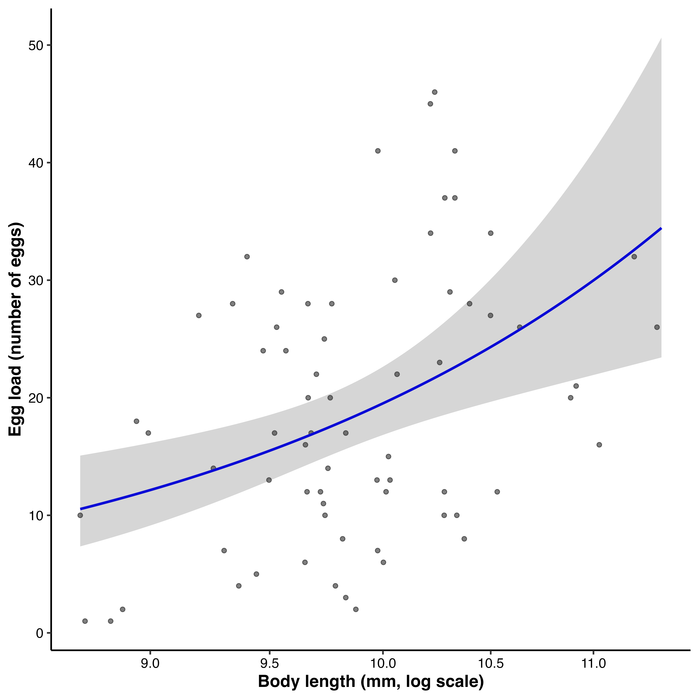
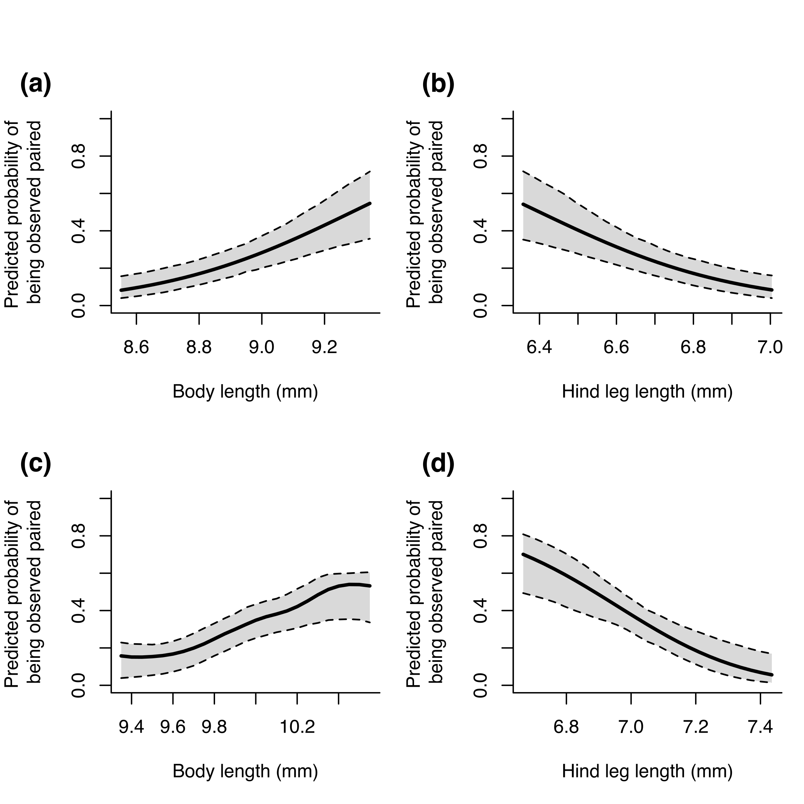
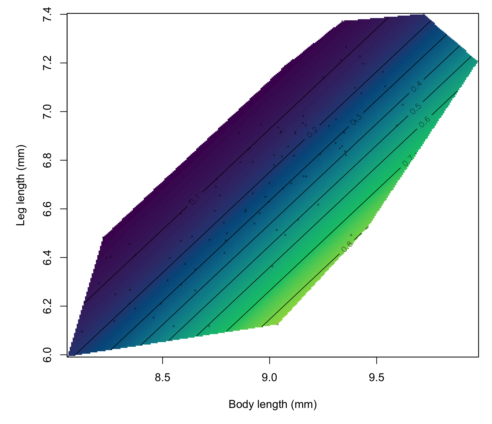

```{r setup, include=FALSE}
source("scripts/weevils.R")
```

```{r echo=FALSE}
knitr::read_chunk('scripts/weevils.R')
```

```{r analysis, include=FALSE,echo=FALSE, warning=FALSE, results="hide"}
```

# Abstract

Sexual size dimorphism (SSD) can reflect sex differences in fecundity, sexual, and viability selection, but contemporary measures of fitness components do not necessarily reveal the processes that originally produced dimorphism. I examined morphology, egg load, and observed pairing status in an undescribed flightless New Zealand weevil (*Lyperobates* sp. A), using body length and hind leg length as focal traits. Female body length was positively associated with egg load at dissection, consistent with fecundity selection favouring larger females, although egg load is not a measure of lifetime reproductive output. The directional selection gradients through observed pairing status were qualitatively similar in females and males: body length was positively associated and hind leg length was negatively associated with pairing status in both sexes, so the two sexes did not experience opposing selection. Only males showed significant nonlinear and correlational selection, indicating that male pairing probability depended on the combination of body and leg length; the highest predicted probability occurred among males combining relatively large bodies with short legs. Females were larger than males in both traits, and body length was not assortative within the 25 observed pairs. Because pairing status was measured during a single sampling period, it may reflect encounter, mounting, or attachment duration rather than lifetime mating or reproductive success. The results document female-biased SSD and show that contemporary pairing-status selection in this population is qualitatively similar in the two sexes but multivariate in males only, and they do not establish that these components caused or currently maintain the dimorphism.

# Introduction

Sexual size dimorphism (SSD) is a widespread and evolutionarily significant feature of animal morphology [@darwin1871; @fairbairn2007]. Its direction and magnitude can reflect sex-specific fecundity and sexual selection, but also viability selection, ecological divergence, developmental processes, and genetic constraints or correlations between the sexes [@fairbairnAllometrySexualSize1997; @blanckenhorn2000; @fairbairn2007]. In many species, male-biased SSD is associated with sexual selection arising from male--male competition or female choice [@andersson1994], whereas female-biased SSD is often associated with fecundity selection because larger females can produce or carry more eggs [@honek1993; @kingsolver2004; @pincheira-donoso2017; @blanckenhorn2005; @zhu2025]. Nevertheless, a positive relationship between female body length and fecundity does not, on its own, demonstrate that fecundity selection produced SSD. Dimorphism is an evolved outcome of selection acting across generations, whereas estimates from a single population and time period describe contemporary phenotypic associations with particular components of fitness.

When sexual selection favours increased male body length, as often occurs under male--male contest competition, male-biased SSD may evolve or female-biased SSD may be reduced [@andersson1994; @emlen1977]. Conversely, female-biased SSD has sometimes been attributed to weak sexual selection on males or to selection favouring smaller, more mobile males [@ghiselin1974; @fairbairn2007]. Scramble-competition polygyny is frequently invoked in this context because male reproductive success can depend on locating and securing females rather than defending resources [@andersson1994; @moya-larano2002]. Smaller males, or males with locomotor morphology that facilitates mate searching, have higher mating success in some systems, including Japanese beetles (*Popillia japonica*) and Cook Strait giant weta (*Deinacrida rugosa*) [@kelly2020; @kelly2008a; @kelly2023c]. Comparative evidence, however, shows that larger males are also favoured in many scramble-competitive arthropods [@herberstein2017]. The direction of selection on male morphology therefore cannot be inferred from a broad mating-system label alone, especially when mate searching and pair formation have not been observed directly.

Multivariate analyses are important because the association between one trait and a fitness component can depend on other traits [@lande1983; @phillips1989; @brodie1995]. For example, body length may influence competitive ability or persistence, whereas leg length may influence movement or the ability to remain attached to a female. Directional gradients describe average slopes of the phenotype--fitness relationship, while quadratic and correlational gradients describe curvature and dependence between traits. These latter components may reveal combinations of morphology associated with high fitness even when the directional gradients for individual traits appear similar between groups.

Assortative mating provides a related but distinct perspective on how morphology structures mating interactions. Positive assortment occurs when individuals with similar trait values pair more often than expected, whereas negative assortment occurs when dissimilar individuals pair preferentially [@crespi1989; @jiang2013]. Assortment can influence the covariance between male and female phenotypes, alter the distribution of mating success, and thereby affect the opportunity for sexual selection and the evolutionary dynamics of sexually dimorphic traits [@mcdonald2016]. An absence of assortment does not imply an absence of selection on morphology: a trait may affect whether an individual is paired without determining the phenotype of its partner.

Weevils (Curculionoidea) encompass substantial ecological and mating-system diversity across approximately 62,000 species [@haran2023], including around 1,500 species endemic to New Zealand [@may1993; see also @brown2017]. *Lyperobates* are flightless, ground-dwelling New Zealand weevils typically associated with alpine and subalpine habitats (@fig-one). The study population was nocturnally active, individuals were commonly found on kawakawa (*Piper excelsum*), and males were sometimes observed mounted on females for extended periods. I did not observe pair formation, systematic male--male contests, or female choice; consequently, the apparent absence of resource defence is consistent with, but does not demonstrate, a scramble-competitive mating system. Here, I examine SSD and contemporary phenotypic selection in an undescribed species of *Lyperobates* (Coleoptera: Curculionidae: Entiminae; hereafter *Lyperobates* sp. A).

I addressed four questions. First, is female body length positively associated with egg load, as expected under fecundity selection? Second, how are body length, hind leg length, and their combination associated with the probability that females and males were observed paired? Third, are females and males dimorphic in body and hind leg length, and do the contemporary selection gradients align with the direction and magnitude of that dimorphism? Finally, is body length assortative within observed mating pairs?

# Methods

### Study species and field sampling

I studied a population of an undescribed *Lyperobates* weevil (hereafter *Lyperobates* sp. A) on Te Pākeka/Maud Island, New Zealand. This taxon is currently under formal description but can be distinguished from described congeners by consistent differences in body length, colouration, and elytral morphology (C.D. Kelly, personal observation). All individuals used in this study conformed to the same diagnostic phenotype and are treated as a single operational taxonomic unit.

Adult weevils were collected on 11 nights between 20 April and 5 May 2007. Individuals were located opportunistically by searching the ground and low vegetation (≤2 m) along a 20-m section of track bordering forest habitat. Sampling began approximately 1 h after sunset (approximately 18:30 h) and continued for 2 h. Weevils were found almost exclusively on kawakawa leaves. I collected each observed male--female pair (*N* = 25), together with singleton males (*N* = 75) and females (*N* = 52), yielding 100 males and 77 females in total. Because collection was opportunistic and paired individuals may differ from singletons in detectability, this sample ratio should not be interpreted as an estimate of the population or operational sex ratio. Each individual was placed in a separate 50-mL Falcon tube, assigned a unique identification code, transported to a field laboratory on Maud Island, and subsequently euthanized by freezing.

All individuals were photographed alongside a ruler for scale. Females (*N* = 69) were dissected, and egg load was quantified as the number of eggs present in the reproductive tract at the time of collection. Egg load provides an index of current reproductive investment, but it may be influenced by female age, mating history, oviposition history, and the timing of egg maturation; it is therefore not equivalent to lifetime realized fecundity. Morphological measurements were obtained from digital images using Fiji [@schindelin2012]. Body length was measured from the anterior edge of the thorax to the posterior edge of the abdomen, and hind leg length was measured on the third leg pair from the proximal end of the femur to the distal end of the tibia, to the nearest 0.01 mm.

### Ethical note

This study involved behavioural observations and morphological measurements of adult *Lyperobates* sp. A weevils. Efforts to minimize stress and disturbance included minimizing handling and maintaining individuals under appropriate conditions during the study. Following completion of the behavioural observations, weevils were humanely euthanized by freezing before dissection and photography. Formal institutional animal ethics approval was not required because the study involved invertebrates. All procedures complied with applicable regulations governing the collection and handling of wildlife in New Zealand and followed the Association for the Study of Animal Behaviour/Animal Behavior Society Guidelines for the Treatment of Animals in Behavioural Research and Teaching [@zotero-item-15212].

### Statistical analyses

All analyses were conducted in R [@rcoreteam2025]. I use *observed pairing status* to describe whether an individual was collected as part of a male--female pair (paired = 1) or as a singleton (unpaired = 0). This cross-sectional measure is a component or proxy of mating success rather than a measure of lifetime mating or reproductive success. An association with pairing status could arise through differences in mate encounter, acceptance, mounting success, pair duration, or detectability. The selection analyses therefore assume that phenotypic differences between paired and unpaired individuals contain information about their relative propensity to be observed paired during the sampling period.

Sex differences in total body length and total hind leg length were assessed using separate linear models of the form `trait ~ sex`. I also used a multivariate analysis of variance, with body and hind leg length as the joint response and sex as the predictor, to test for overall sexual dimorphism across the two traits.

Phenotypic selection through observed pairing status was analysed separately for males and females. The male analysis included 100 individuals, of which 25 were paired and 75 were unpaired; the female analysis included 77 individuals, of which 25 were paired and 52 were unpaired. For each sex, I fitted a generalized additive model using `mgcv::gam()` with the formula

`mated ~ s(total_body, bs = "tp", k = 10) + s(total_leg, bs = "tp", k = 10)`.

Pairing status was modelled using a binomial error distribution and logit link. Body and hind leg length were represented by separate penalized thin-plate regression splines, each with a basis dimension of (k=10), and smoothing parameters were selected using the `method = "GCV.Cp"` option [@wood2017]. The models were additive on the logit scale and did not include an explicit tensor-product interaction between the two traits.

I estimated standardized selection differentials and gradients following Lande and Arnold [-@lande1983] using the *gsg* package [@morrissey2013]. The GAMs were fitted to traits measured in millimetres, but `gsg` standardized the resulting differentials and gradients to units of one within-sex phenotypic standard deviation. Standardized directional and quadratic selection differentials were calculated separately for each trait using `moments.differentials()` with 10,000 bootstrap replicates. Directional differentials (*S*) describe the total association between a trait and pairing status, whereas quadratic differentials (*C*) describe changes in trait variance associated with pairing status.

Standardized linear, diagonal quadratic, and correlational selection gradients were calculated from each fitted GAM using `gam.gradients()`. Linear gradients (β) describe the average directional association between a trait and relative pairing status after accounting for the other trait. Diagonal quadratic gradients (γ~ii~) describe average response-scale curvature, whereas the correlational gradient (γ~ij~) is the response-scale cross-derivative describing how the association between one trait and pairing status varies with the other trait [@phillips1989; @brodie1995]. Because the models used a nonlinear logit link, the response-scale correlational gradient can be nonzero even though the GAM predictor contained separate additive smooths rather than an explicit interaction term.

The `gam.gradients()` function derives gradients from the fitted absolute-fitness function, divides them by mean fitness, and standardizes them by the observed phenotypic standard deviations. The returned estimates are therefore expressed on the standardized relative-fitness scale [@morrissey2013]. Diagonal quadratic gradients and their standard errors were reported exactly as returned by `gam.gradients()`; no additional doubling was applied. Standard errors and two-sided *P*-values were obtained from 10,000 parametric-bootstrap replicates (`se.method = "boot.para"`). During bootstrapping, smoothing parameters were fixed at the values estimated from the original data (`refit.smooth = FALSE`). Values returned as zero were reported as *P* < 0.001. The gradients were estimated separately by sex, so statistical support for a gradient in one sex but not the other does not by itself demonstrate that the corresponding gradients differed between the sexes.

For the one-dimensional visualizations, I used `fitness.landscape()` to calculate predicted mean pairing probability across 25 values of the focal trait spanning one phenotypic standard deviation below to one standard deviation above its sex-specific mean. When body length was the focal trait, hind leg length was retained at its observed individual values, and vice versa; predictions were then averaged across the observed distribution of the alternate trait. Thus, these curves are marginal fitness landscapes rather than predictions conditional on a single fixed value of the alternate trait. Shaded regions and dashed lines show central 95% parametric-bootstrap intervals based on 1,000 replicates, with smoothing parameters held fixed.

The two-dimensional male response surface was generated directly from the fitted male GAM. Predicted pairing probabilities were calculated on a 300 × 300 grid spanning the observed ranges of male body and hind leg length. Predictions for trait combinations outside the convex hull of the observed male phenotypes were excluded to avoid displaying unsupported extrapolations, and the observed male phenotypes were superimposed on the surface.

The relationship between female body length and egg load was analysed using a negative-binomial generalized linear model fitted with `MASS::glm.nb()` to accommodate overdispersion in egg counts [@venables2002]. The model formula was `eggs ~ log(total_body)`, with the default logarithmic link. This analysis estimates the association between body length and egg load at collection; I interpret a positive association as consistent with, rather than definitive evidence of, fecundity selection.

I assessed body-length assortment among the 25 observed pairs by regressing standardized female body length on standardized male body length [@crespi1989; @jiang2013]. I also conducted a two-sided randomization test with 10,000 iterations. In each iteration, females were randomly reassigned among the sampled males, the regression slope was recalculated, and the absolute randomized slope was compared with the absolute observed slope. The randomization *P*-value was the proportion of iterations producing a slope at least as extreme as the observed value.


# Results

### Female body length and egg load

Female egg load increased with body length (@fig-two). Egg number was positively associated with log-transformed body length ($\beta$ = `r myround(summary(female.fecundity)$coefficients[2,1],2)` ± `r myround(summary(female.fecundity)$coefficients[2,2],2)`, *z* = `r myround(summary(female.fecundity)$coefficients[2,3],2)`, `r pvalue(summary(female.fecundity)$coefficients[2,4],accuracy = 0.001, add_p=TRUE)`). This association is consistent with fecundity selection favouring greater female body length, while recognizing that egg load is a snapshot of current reproductive state rather than lifetime fecundity.

### Phenotypic selection through observed pairing status

The directional selection gradients on body and hind leg length through observed pairing status were qualitatively similar in females and males (@tbl-one; @fig-three). In both sexes, body length was positively associated with pairing status (males: β~body~ = `r myround(male.estimates[[1,1]],2)` ± `r myround(male.estimates[[1,2]],2)`, `r pvalue(male.estimates[[1,3]],accuracy = 0.001, add_p=TRUE)`; females: β~body~ = `r myround(female.estimates[[1,1]],2)` ± `r myround(female.estimates[[1,2]],2)`, `r pvalue(female.estimates[[1,3]],accuracy = 0.001, add_p=TRUE)`), whereas hind leg length was negatively associated with pairing status (males: β~leg~ = `r myround(male.estimates[[2,1]],2)` ± `r myround(male.estimates[[2,2]],2)`, `r pvalue(male.estimates[[2,3]],accuracy = 0.001, add_p=TRUE)`; females: β~leg~ = `r myround(female.estimates[[2,1]],2)` ± `r myround(female.estimates[[2,2]],2)`, `r pvalue(female.estimates[[2,3]],accuracy = 0.001, add_p=TRUE)`). The two sexes therefore did not experience opposing directional selection regimes on these traits. These associations may reflect differences in encounter, mounting, attachment duration, or another unmeasured process and should not be interpreted automatically as differences in lifetime reproductive success.

Despite the qualitative similarity of the directional gradients, the male analysis also supported nonlinear and correlational selection (Table 1; Figure 4). Both male traits had significant positive diagonal quadratic gradients (males: $\gamma$~ii_body~ = `r myround(male.estimates[[3,1]],2)` ± `r myround(male.estimates[[3,2]],2)`, `r pvalue(male.estimates[[3,3]],accuracy = 0.001, add_p=TRUE)`; $\gamma$~ii_leg~ = `r myround(male.estimates[[4,1]],2)` ± `r myround(male.estimates[[4,2]],2)`, `r pvalue(male.estimates[[4,3]],accuracy = 0.001, add_p=TRUE)`) and there was significant negative correlational selection between male body and hind leg length ($\gamma$~ij~ = `r myround(male.estimates[[5,1]],2)` ± `r myround(male.estimates[[5,2]],2)`, `r pvalue(male.estimates[[5,3]],accuracy = 0.001, add_p=TRUE)`). The fitted surface therefore indicated that, on the probability scale, the association between either male trait and observed pairing status varied with the value of the other trait. Within the observed phenotypic range, predicted pairing probability was highest among males combining relatively large body length with short hind legs.

The female analysis provided no statistical support for nonlinear selection on body length ($\gamma$~ii_body~ = `r myround(female.estimates[[3,1]],2)` ± `r myround(female.estimates[[3,2]],2)`, `r pvalue(female.estimates[[3,3]],accuracy = 0.001, add_p=TRUE)`), nonlinear selection on hind leg length ($\gamma$~ii_leg~ = `r myround(female.estimates[[4,1]],2)` ± `r myround(female.estimates[[4,2]],2)`, `r pvalue(female.estimates[[4,3]],accuracy = 0.001, add_p=TRUE)`), or correlational selection between the traits ($\gamma$~ij~ = `r myround(female.estimates[[5,1]],2)` ± `r myround(female.estimates[[5,2]],2)`, `r pvalue(female.estimates[[5,3]],accuracy = 0.001, add_p=TRUE)`). Because the gradients were estimated separately by sex, statistical support in males but not females does not itself demonstrate that the corresponding gradients differed significantly between the sexes.

### Sexual dimorphism

The sampled adults comprised 100 males and 77 females (56.5% male), but this opportunistic sample cannot be used to infer the population sex ratio. Females were larger than males in both total body length and total hind leg length (@fig-five). Mean body length was `r myround(summary_stats[[1,3]],2)` ± `r myround(summary_stats[[1,4]],2)` mm (*n* = `r summary_stats[[1,2]]`) in females and `r myround(summary_stats[[2,3]],2)` ± `r myround(summary_stats[[2,4]],2)` mm (*n* = `r summary_stats[[2,2]]`) in males, so females were approximately `r myround(((summary_stats[[1,3]]-summary_stats[[2,3]])/summary_stats[[2,3]])*100,1)`% longer (female:male ratio = `r myround((summary_stats[[1,3]]/summary_stats[[2,3]]),2)`). Males were, on average, 1.00 mm shorter than females ($\beta$ = `r myround(summary(model_body)$coefficients[2,1],2)` ± `r myround(summary(model_body)$coefficients[2,2],2)`, *t* = `r myround(summary(model_body)$coefficients[2,3],2)`, `r pvalue(summary(model_body)$coefficients[2,4],accuracy = 0.001, add_p=TRUE)`; *R*^2^ = `r myround(summary(model_body)$r.squared,2)`).

Females also had longer hind legs than males (`r myround(summary_stats[[1,6]],2)` ± `r myround(summary_stats[[1,7]],2)` mm versus `r myround(summary_stats[[2,6]],2)` ± `r myround(summary_stats[[2,7]],2)` mm), a difference of `r myround(((summary_stats[[1,6]]-summary_stats[[2,6]])/summary_stats[[2,6]])*100,1)`% (female:male ratio = `r myround((summary_stats[[1,6]]/summary_stats[[2,6]]),2)`). This difference was statistically supported ($\beta$ = `r myround(summary(model_leg)$coefficients[2,1],2)` ± `r myround(summary(model_leg)$coefficients[2,2],2)`, *t* = `r myround(summary(model_leg)$coefficients[2,3],2)`, `r pvalue(summary(model_leg)$coefficients[2,4],accuracy = 0.001, add_p=TRUE)`; *R*^2^ = `r myround(summary(model_leg)$r.squared,2)`). The multivariate sex effect was also supported (MANOVA: Pillai's trace = `r myround(summary(manova_model)$stats[1, "Pillai"],2)`, *F*~`r summary(manova_model)$stats[1, "num Df"]`,`r summary(manova_model)$stats[1, "den Df"]`~ = `r myround(summary(manova_model)$stats[1, "approx F"],2)`, `r pvalue(summary(manova_model)$stats[1, "Pr(>F)"],accuracy = 0.001, add_p=TRUE)`).

### Assortative mating

There was no evidence that body length was assortative within the 25 observed pairs. The relationship between male and female body length was weak and non-significant ($\beta$ = `r myround(summary(assort)$coefficients[2,1],2)` ± `r myround(summary(assort)$coefficients[2,2],2)`, *t* = `r myround(summary(assort)$coefficients[2,3],2)`, `r pvalue(summary(assort)$coefficients[2,4],accuracy = 0.001, add_p=TRUE)`), and the observed slope did not differ from the randomized distribution (*P* = `r p_val[1]`). Thus, body length did not measurably structure which sampled male was paired with which sampled female.

# Discussion

Females were larger than males in both body and hind leg length, and female body length was positively associated with egg load. Through observed pairing status, the directional selection gradients on body and hind leg length were qualitatively similar in females and males: body length was positively associated and hind leg length was negatively associated with pairing in both sexes. The two sexes therefore did not experience opposing directional selection regimes on these traits. The principal sex-specific signal in the data was that only males showed supported nonlinear and correlational selection: within the sampled phenotypic range, males combining relatively large bodies with short hind legs had the highest predicted probability of being observed paired, whereas female pairing probability was described by independent directional gradients alone. Body length was not assortative within observed pairs. Together, these findings document female-biased SSD and several contemporary morphology--fitness-component associations, but they do not demonstrate that the measured selection components caused or currently maintain the dimorphism.

The positive association between female body length and egg load is consistent with a common mechanism proposed for female-biased SSD: larger females can allocate more space or resources to egg production [@honek1993; @kingsolver2004; @blanckenhorn2005; @pincheira-donoso2017]. The inference is nevertheless narrower than a direct estimate of lifetime fecundity selection. The number of eggs present at dissection represents current egg load and may vary with age, reproductive stage, previous oviposition, and the rate at which eggs mature [e.g. @kelly2024b]. Consequently, the result shows that longer females carried more eggs at collection; it does not establish how body length affects lifetime egg production, offspring recruitment, or population growth. Repeated measures of oviposition or lifetime reproductive output would provide a stronger test.

The associations between morphology and observed pairing status also require careful interpretation. Paired males were not followed across a mating season, and the survey did not record the number of females encountered, copulations completed, offspring sired, or the duration for which each male had been mounted. A phenotype associated with prolonged attachment could be overrepresented among observed pairs even if it did not increase the number of matings or fertilizations. The male gradients may therefore reflect mate searching, mounting, female acceptance, attachment duration, detectability, or some combination of these processes. Likewise, the field observations are consistent with a scramble-like system because males were not seen defending resources, but pair formation and male--male interactions were not observed systematically. The present data cannot exclude female choice, interference among males, or other forms of competition.

The qualitative similarity of the directional gradients between the sexes is itself the central feature of these results. Both females and males showed positive body-length gradients and negative hind-leg gradients through pairing status, with similar estimated magnitudes. The supported male correlational gradient adds a second layer: within males, the association between body length and pairing depended on hind leg length, and the highest predicted pairing probabilities occurred among relatively large-bodied, short-legged males. The biological mechanism behind this combination is unresolved, and several hypotheses—concerning movement, leverage, stability while mounted, or attachment duration—are plausible but not testable with these data. Pairing probability in females, by contrast, was described by independent directional gradients alone, and no sex-specific combination effect was detected. Existing dimorphism may therefore reflect selection acting in earlier generations, sex-specific viability selection, development, ecological differences, genetic architecture, or fitness components not measured here [@fairbairnAllometrySexualSize1997; @blanckenhorn2000; @fairbairn2007]. The greater proportional dimorphism in body length than in hind leg length also does not map straightforwardly onto the contemporary gradients. This mismatch is informative because it cautions against inferring the evolutionary cause of SSD from a single episode or component of phenotypic selection.

The absence of body-length assortment indicates that, among the 25 pairs sampled, large males were no more likely to be paired with large females than expected by chance. This result does not contradict selection through pairing status. Morphology may affect the probability of being paired while having little effect on the phenotype of the eventual partner [@mcdonald2016]. The modest number of pairs nevertheless limits power to detect weak assortment, and a single nocturnal snapshot cannot reveal whether assortment varies through the season or across sites.

The scope of inference is necessarily limited to this population, sampling interval, and taxon. A single-species result cannot establish a general rule for flightless weevils or scramble-competitive arthropods. Its broader contribution is instead comparative: it adds an example in which female-biased SSD co-occurs with a positive body-length--egg-load association, similar directional pairing-status gradients in the sexes, and a complex male multivariate surface. Determining whether these features recur in related weevils will require replicated sampling across populations, dates, and species, ideally combined with direct observation of mate searching, pair formation, pair duration, and reproductive success.

Several limitations are therefore central rather than peripheral. The 25 observed pairs came from one site and a restricted 11-night period; pairing status was binary and cross-sectional; egg load was measured once; and behaviour linking morphology to pairing was not recorded directly. The opportunistically collected sex ratio may also reflect sex-specific activity or detectability rather than population abundance. These constraints increase uncertainty about temporal repeatability and the biological processes underlying the statistical associations. Future work should combine repeated field surveys with behavioural observations, experimental measures of locomotion and attachment, and more complete estimates of female and male reproductive success.

In conclusion, this study documents female-biased SSD, a positive association between female body length and egg load, and qualitatively similar directional gradients on body and hind leg length through observed pairing status in female and male *Lyperobates* sp. A. The principal sex-specific signal is that pairing probability in males depended on the combination of body and hind leg length, whereas female pairing probability was described by independent directional gradients alone. However, the cross-sectional measures of egg load and pairing status, together with the qualitative similarity of the directional gradients between the sexes, prevent a strong causal inference that these contemporary associations produced the observed SSD. The results are best interpreted as evidence that contemporary components of selection in this population are incompletely aligned with existing sexual dimorphism.

\newpage

# Data availability

Data are available through the OSF repository at <https://osf.io/khqgs/overview?view_only=728733529d06410ab17086f648a49a38>[.](https://doi.org/10.17605/OSF.IO/7FP9J.){.uri}

# Funding

This research was supported by a Natural Sciences and Engineering Research Council of Canada (NSERC) Discovery Grant.

# Conflict of Interest

I declare no conflict of interest.

# Acknowledgements

I thank Steve Ward of the New Zealand Department of Conservation for logistical support while this work was conducted on Maud Island. I also thank Samuel Brown (The New Zealand Institute for Plant & Food Research Limited), Neil Birrell (University of Auckland), and Rich Leschen (New Zealand Arthropod Collection, Landcare Research Group) for help with taxonomic identification of my study species.

\newpage

# References {.unnumbered}

::: {#refs}
:::

\newpage

::: landscape
```{r}
#| echo: false
#| results: asis
#| warning: FALSE
#| label: tbl-one
#| tbl-cap: "Selection differentials (S, C) and standardized linear (β) and diagonal quadratic (γ) selection gradients through observed pairing status for female and male *Lyperobates* sp. A weevils. Estimates are means ± SE. Differentials quantify total phenotypic selection, whereas gradients describe associations with each trait after accounting for the other trait. Estimates were returned directly by `gsg::gam.gradients()` on the relative-fitness scale; diagonal quadratic gradients and SEs were not doubled. Standard errors and two-sided *P*-values were obtained from 10,000 parametric-bootstrap replicates."

ft
```
:::

::: {#fig-one fig-cap="Mating pair of *Lyperobates* sp. A weevils. The male is mounted dorsally on the female in a typical copulatory position. (a) Lateral (side) view showing the male positioned atop the female’s abdomen, with legs grasping the female’s body. (b) Frontal view illustrating the alignment of the pair and relative positioning of the male on the female’s dorsum."}

:::

::: {#fig-two fig-cap="Relationship between female body length and egg load. Points represent individual females, and egg load is the number of eggs present in the reproductive tract at dissection. Body length is plotted on a log scale. The line shows the fitted mean from the negative-binomial generalized linear model, and the shaded region is the 95% confidence interval. Egg load increased with body length; this cross-sectional measure is not equivalent to lifetime realized fecundity."}
 
:::

::: {#fig-three fig-cap="Associations between morphology and observed pairing status in males (a–b) and females (c–d). Panels show the predicted probability of being observed paired from binomial generalized additive models as a function of body length (a, c) and hind leg length (b, d), with the alternate trait held constant. Solid lines are model predictions and dashed lines are 95% intervals estimated by parametric bootstrapping. In both sexes, body length had a positive directional gradient and hind leg length had a negative directional gradient. Pairing status is a cross-sectional proxy and may reflect encounter, mounting, or pair duration rather than lifetime reproductive success."}
 
:::

::: {#fig-four fig-cap="Predicted probability that a male was observed paired as a function of body length and leg length. Colours and labelled contours represent fitted probabilities from the generalized additive model. Points show observed males, and predictions are restricted to the convex hull of the observed combinations of body and leg length. Higher pairing probabilities were associated with greater body length relative to leg length."}

:::

::: {#fig-five fig-cap="Sexual dimorphism in body and hind leg length. Boxplots show total body length and total hind leg length (mm) for females (light grey) and males (dark grey), with points representing individuals. Horizontal lines are medians, boxes are interquartile ranges, and whiskers extend to 1.5× the interquartile range. Females were significantly larger than males for both traits, as assessed by the linear models reported in the Results."}
 
:::


