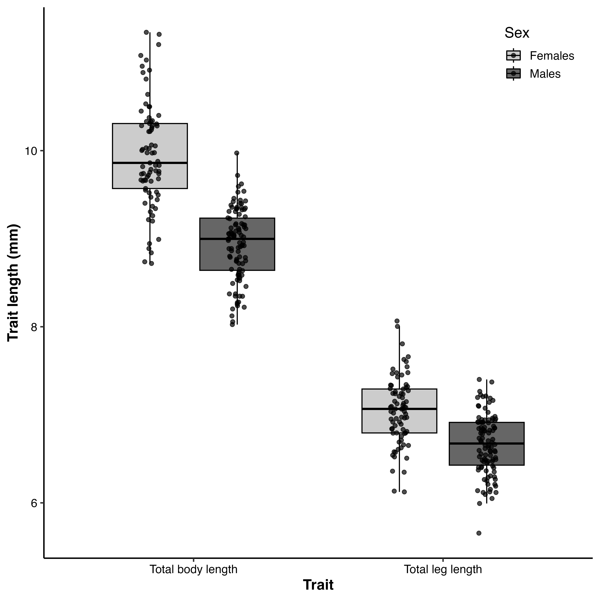

```{r echo=FALSE}
knitr::read_chunk('scripts/weevils.R')
```

```{r analysis, include=FALSE,echo=FALSE, warning=FALSE, results="hide"}
```

# Abstract
Sexual size dimorphism (SSD) arises from the interplay between fecundity selection and sexual selection, yet their relative contributions remain poorly understood in many systems, particularly those characterized by scramble competition. I investigated the drivers of SSD in an undescribed flightless New Zealand weevil (*Lyperobates* sp. A) by quantifying fecundity selection on females and multivariate sexual selection on males using body length and hind leg length. Female fecundity increased strongly with body size, indicating pronounced fecundity selection favoring larger females. Contrary to expectations for scramble-competitive mating systems, sexual selection on males did not favor smaller size. Instead, larger males achieved higher mating success, revealing strong positive directional selection on body size. Selection was distinctly multivariate: males with relatively shorter legs had higher mating success, and significant negative correlational selection showed that fitness was maximized by specific trait combinations—large body size paired with short legs—producing a ridge-shaped fitness surface. Females also experienced directional selection on morphology, but without evidence of nonlinear or correlational effects. Despite strong selection, mating was random with respect to body size, suggesting that assortative mating does not structure sperm competition in this population. Females were significantly larger than males, confirming female-biased SSD. Together, these results demonstrate that SSD in this species is driven by strong fecundity selection on females alongside complex, multivariate sexual selection on males. More broadly, they show that scramble competition can favor larger males and that trait interactions are critical for understanding the evolution of dimorphism.

# Introduction

Sexual size dimorphism (SSD)—systematic differences in body size between males and females—is a widespread and evolutionarily significant feature of animal morphology (Darwin, 1871; Fairbairn, 1997). The direction and magnitude of SSD vary widely across taxa, reflecting the balance of sex-specific selection pressures acting on body size (Blanckenhorn, 2000; Fairbairn et al., 2007). In many species, male-biased SSD arises through sexual selection driven by male–male competition or female choice (Andersson, 1994), whereas female-biased SSD is often attributed to fecundity selection, whereby larger females achieve higher reproductive output (Honěk, 1993; Kingsolver & Pfennig, 2004; Blanckenhorn, 2005; Pincheira-Donoso & Hunt, 2017). However, fecundity selection alone cannot fully explain patterns of SSD, as the evolution of dimorphism also depends critically on the strength and direction of sexual selection acting on males [@fairbairn2007; @blanckenhorn2000].

When sexual selection favors increased male size—such as in systems involving male–male contest competition—male-biased SSD may evolve or female-biased SSD may be reduced (Andersson, 1994; Emlen & Oring, 1977).
Conversely, female-biased SSD is expected when sexual selection on males is weak, absent, or favors smaller, more mobile males (Ghiselin, 1974; Blanckenhorn et al., 2007). Scramble-competitive mating systems are often invoked as a context in which smaller males are favored because reproductive success depends on efficiently locating and securing mates rather than engaging in direct contests (Andersson, 1994; Moya-Laraño et al., 2002). Empirical support for this “mobility hypothesis” comes from systems in which smaller males, or males possessing morphology that enhances locomotor performance, achieve higher mating success, including in Japanese beetles, where smaller males with relatively larger wings are more successful (kelly 2020) in the Cook Strait giant weta (Deinacrida rugosa) where males with smaller bodies and longer leggs have greater mating success (kelly et al. 2008; kelly and gwynne 2023). However, this expectation is not universal. Comparative evidence shows that scramble competition encompasses diverse selective regimes, and that larger males frequently achieve greater mating success despite the presumed importance of mobility (Herberstein et al., 2017). This suggests that traits such as endurance, mate detection, or persistence may outweigh any locomotor advantages of reduced body size. Thus, predicting the direction of sexual selection on male size in scramble systems requires empirical evaluation rather than reliance on general assumptions.

In addition to trait-based selection, patterns of mating interactions can strongly influence the strength of sexual selection. In polyandrous populations, where females mate with multiple males, reproductive success depends not only on mating success but also on the degree of sperm competition experienced by males. Crucially, this depends on how males share mating partners within a population. Sexual selection is therefore shaped by the relationship between a male’s mating success and the mating success of his partners, which determines the intensity of sperm competition he experiences (mcdonald and pizzarri 2016). When mating is positively assortative, males with high mating success tend to mate with highly polyandrous females, increasing sperm competition and reducing reproductive returns per mating (mcdonald and pizzarri 2016). Conversely, negative assortative mating can reduce sperm competition for successful males and strengthen sexual selection (e.g. kelly and gwynne 2023). These insights highlight that mating structure—not just mating success—plays a central role in determining the strength and direction of sexual selection.

Weevils (Curculionoidea) demonstrate significant ecological and mating system diversity among approximately 62,000 species [@haran2023], with around 1,500 species endemic to New Zealand [@may1993], making them valuable for investigating the role of sexual selection in the evolution of SSD. Within this context, *Lyperobates* weevils, a genus of flightless, ground-dwelling beetles specific to New Zealand, are typically found in alpine and subalpine habitats. These nocturnal insects occupy structurally complex environments where individuals emerge at night to forage and locate mates. Notably, males do not appear to defend mating-related resources, indicating a scramble-competitive mating system (Andersson, 1994; Blanckenhorn et al., 2007) in which mate encounter rates and search efficiency are crucial. Once a male successfully locates and mounts a female, he may remain mounted for several hours, copulating intermittently throughout this duration. Here, we investigate sexual size dimorphism in an undescribed species of *Lyperobates* (hereafter *Lyperobates* sp. A).
I test four predictions. First, we predict that fecundity selection favors larger females, resulting in a positive relationship between female body size and reproductive output. Second, based on classic expectations for scramble competition, we predict that sexual selection on males will be weak or favor smaller body size, while acknowledging that alternative outcomes are possible (Herberstein et al., 2017). Third, we predict that these forces will result in female-biased SSD. Finally, we predict that patterns of assortative mating will reflect the direction of selection on male size.

#Methods 

### Study species 

I studied a population of an undescribed species of *Lyperobates* weevil (hereafter *Lyperobates* sp. A) collected on Maud Island/Te Hoiere, New Zealand. This taxon is currently under formal description, but can be reliably distinguished from described congeners based on consistent differences in body size, coloration, and elytral morphology (C.D. Kelly, personal observation.). All individuals used in this study conformed to this diagnostic phenotype and are treated as a single, cohesive lineage.

Adult weevils were collected on 11 nights between 20 April and 5 May 2007 on Maud Island/Te Hoiere, New Zealand. Individuals were located opportunistically at night by searching the ground and low vegetation (≤ 2 m height) along a 20 m section of track bordering forest habitat.Sampling commenced approximately 1 hour after sunset (\~18:30 h) and continued for two hours. Weevils were found almost exclusively on the leaves of kawakawa (*Piper excelsum*). Each observed male–female pair (N = 25), along with singleton males (N = 75) and females (N = 52), was collected and placed individually into 50 mL Falcon tubes, assigned a unique identification code, and transported to a field laboratory on Maud Island. Specimens were subsequently euthanized by freezing. All individuals were digitally photographed alongside a ruler for scale. Females (N=69) were dissected to quantify fecundity by counting the number of eggs present in the reproductive tract. Morphological measurements were obtained from digital images using Fiji (Schindelin et al., 2012), including body length (from the anterior edge of the thorax to the posterior edge of the abdomen) and hind leg length (third pair; from the proximal end of the femur to the distal end of the tibia), measured to the nearest 0.01 mm.

### Statistical Analyses

All analyses were conducted in R (R Core Team, 2025). Morphological traits were measured as total body length and total leg length. Sex differences in these traits were first assessed using linear models with sex as a fixed effect. Additionally, we performed a multivariate analysis of variance (MANOVA) to test for overall sexual dimorphism across traits.

To quantify the strength and form of selection on total body length and total hind leg length, we estimated standardized selection differentials and gradients following Lande and Arnold (1983) using the *gsg* R package (Morrissey & Sakrejda, 2013). Both traits were standardized to mean zero and unit variance prior to analysis. Directional selection differentials (S) were calculated as the covariance between each trait and relative fitness (Lande & Arnold, 1983). Selection gradients were used to estimate direct selection on traits: linear gradients (β) describe directional selection, quadratic gradients (γ) describe nonlinear (stabilizing or disruptive) selection, and correlational gradients (γᵢⱼ) describe selection on trait combinations (Phillips & Arnold, 1989; Brodie et al. 1995). Fitness was modeled as a function of total body length and total hind leg length using spline-based generalized additive models (Wood, 2017), which allow flexible estimation of fitness surfaces without assuming a specific functional form and accommodate non-normal fitness distributions. Male mating success was treated as a binomial response (mated = 1, unmated = 0). Selection gradients (β, γ, γᵢⱼ) were estimated separately for each sex. Statistical significance was assessed using permutation tests implemented in gsg (Morrissey & Sakrejda, 2013), where trait–fitness associations were randomized to generate null distributions.

Female fecundity selection was analyzed using a negative binomial generalized linear model (GLM) to account for overdispersion in egg counts (Venables & Ripley, 2002). Egg number was modeled as a function of log-transformed body size.

Assessing assortative mating provides insight into how mating success translates into reproductive success, because it influences the distribution of sperm competition across males and thus the strength of sexual selection (macdonald and pizzarri 2016). We evaluated assortative mating by testing for a relationship between male and female body size within mating pairs using linear regression on standardized traits (Crespi, 1989; Jiang et al., 2013).To determine whether the observed slope differed from random expectations, we performed a permutation test in which pairings were randomized and slopes recalculated across iterations.

#Results

#### Fecundity Selection on Females
In support of my first prediction, female fecundity increased significantly with body size (Fig. 1), consistent with the widely reported positive relationship between body size and egg production in insects (Honěk, 1993; Kingsolver & Pfennig, 2004). Egg number was positively related to log-transformed body length (β = 4.50 ± 1.33, z = 3.39, P = 0.0007), indicating strong fecundity selection favoring larger females.

### Sexual Selection on Males
Contrary to my second prediction, we found no evidence that sexual selection favors smaller males. Instead, male body length was under strong positive directional selection (β = 0.968 ± 0.257, P < 0.001), indicating that larger males achieved higher mating success (Fig. 2a,c). This pattern is inconsistent with predictions of scramble-competition theory (Blanckenhorn et al., 2007; Moya-Laraño et al., 2002).

Selection was multivariate in both sexes (Phillips & Arnold, 1989). In males, body length experienced positive directional selection, whereas hind leg length was under significant negative directional selection (β = −0.954 ± 0.259, P = 0.002), indicating that males with relatively shorter legs had higher mating success (Fig. 2b,d).

In addition to directional effects, both male traits exhibited significant nonlinear selection. Body length showed positive quadratic selection (γ = 1.203 ± 0.751, P < 0.001), and leg length also experienced positive quadratic selection (γ = 1.169 ± 0.758, P < 0.001), indicating curvature in the fitness surface. Importantly, we also detected significant negative correlational selection between traits (γ = −0.593 ± 0.358, P = 0.002). The fitness surface (Fig. 3) reveals that this interaction strongly shapes the adaptive landscape, such that mating success is highest for males with large bodies and relatively short legs. This produces a ridge-like fitness surface rather than independent optima for each trait.

In females, directional selection was also evident: body length was under positive selection (β = 0.930 ± 0.394, P = 0.034), while leg length was under strong negative selection (β = −1.224 ± 0.338, P < 0.001; Fig. 2c,d). However, we detected no evidence for nonlinear or correlational selection in females (all P > 0.09).

### Sexual Size Dimorphism
Consistent with my third prediction, females were significantly larger than males in both total body length and total hind leg length (Fig. 4), demonstrating pronounced female-biased sexual size dimorphism (SSD), a pattern widely observed across insects (Fairbairn et al., 2007; Blanckenhorn, 2000). Mean body length was 9.95 ± 0.07 mm in females and 8.95 ± 0.04 mm in males, indicating that females were approximately 11.2% larger than males (female:male ratio = 1.11). Linear modelling confirmed that males were, on average, 1.00 mm shorter than females (β = −1.00 ± 0.08 SE, t = −13.34, P < 2 × 10⁻¹⁶; R² = 0.50).

Hind leg length showed a similar pattern, with females exhibiting longer legs than males (7.05 ± 0.04 mm vs. 6.68 ± 0.03 mm), corresponding to a 5.5% increase in females (ratio = 1.06). This difference was also statistically significant (β = −0.37 ± 0.05 SE, t = −6.95, P = 6.8 × 10⁻¹¹; R² = 0.22). A multivariate analysis confirmed strong overall sexual dimorphism across traits (MANOVA: Pillai’s trace = 0.57, F₂,₁₇₄ = 117.46, P < 2.2 × 10⁻¹⁶).

#### Assortative Mating
There was no evidence of assortative mating. The relationship between male and female body size within mating pairs was weak and non-significant (β = −0.23 ± 0.20, P = 0.268), and did not differ from random expectations (P = 0.437; Crespi, 1989). Thus, mating appeared random with respect to body size.

# Discussion

Although Lyperobates sp.A remains formally undescribed, multiple lines of evidence indicate that it represents a distinct and cohesive taxonomic entity. All individuals examined shared consistent morphological characteristics, and only a single morphotype was encountered at the study site. I therefore consider it appropriate to treat this taxon as a single species for the purposes of analyzing patterns of selection and sexual size dimorphism.

Consistent with my predictions, females were significantly larger than males, demonstrating pronounced female-biased SSD. This pattern aligns with extensive evidence from insects showing that fecundity selection favors increased female size (Honěk, 1993; Shine, 1988; Fairbairn et al., 2007). We found strong support for this mechanism, with larger females carrying more eggs, indicating that increased body size directly enhances reproductive output. These results suggest that fecundity selection is sufficiently strong to drive divergence in body size between the sexes, even in the absence of strong opposing selection on males.

Contrary to my initial prediction, we found that sexual selection favors larger males rather than smaller ones. While this result appears inconsistent with traditional expectations for scramble-competitive systems, it is broadly consistent with comparative evidence showing that larger males frequently achieve higher mating success even in the absence of direct contest competition (Herberstein et al., 2017). At the same time, other scramble systems conform to the classic mobility-based prediction. For example, in Japanese beetles, sexual selection favors smaller males and relatively larger wings, indicating that reduced body size and enhanced locomotor performance can improve mate-search efficiency (Kelly 2020). The contrast between that system and my results highlights that the direction of selection on male size is highly context-dependent.
Together, these findings indicate that scramble competition is not governed by a single selective mechanism, but instead reflects the balance between mobility, encounter rates, and post-encounter processes such as mate retention.

Recent work emphasizes that sexual selection depends not only on variance in mating success but also on how mating interactions are structured within populations. In polyandrous systems, males do not compete for exclusive access to females but instead share fertilization opportunities, such that reproductive success depends critically on the intensity of sperm competition they experience. This, in turn, is determined by the relationship between a male’s mating success and that of his partners (McDonald & Pizzari 2016). When mating is positively assortative, successful males tend to mate with highly polyandrous females, resulting in diminishing reproductive returns per mating and weaker sexual selection. In contrast, negative assortative mating can reduce sperm competition for successful males and strengthen selection.In Lyperobates sp.
A, we found no evidence of assortative mating, indicating that males do not systematically experience differences in sperm competition intensity based on their mating success. As a result, although larger males achieve higher mating success, the reproductive benefits of this success are unlikely to be strongly modified by mating structure. This suggests that sexual selection in this system is driven primarily by differences in mating success itself, rather than by structured variation in post-copulatory competition.

My results demonstrate that sexual selection acts on combinations of traits rather than on body size alone. In males, we detected strong negative correlational selection on body size and leg length, indicating that mating success is maximized by specific trait combinations rather than by independent trait values. The fitness surface reveals a ridge-like pattern, where males with large bodies and relatively short legs achieve the highest fitness, while alternative combinations are disfavored. This result refines a simple “bigger is better” interpretation of sexual selection in this system. Although larger males generally have higher mating success, this advantage depends on their associated morphology—specifically, relatively shorter legs. Such correlational selection implies functional integration between traits, likely reflecting performance trade-offs that influence mate-search efficiency, stability during mating, or endurance. For example, larger male Lyperobates sp. A may be more effective at locating females or winning initial access, whereas shorter legs may improve their ability to maintain contact or resist displacement during copulation. More broadly, this pattern highlights that sexual selection can favor trait combinations that lie along a fitness ridge, rather than single optimal values for individual traits. As a result, interpreting selection on any one trait in isolation may be misleading, because its fitness consequences depend on the values of other traits.

Taken together, my results indicate that female-biased SSD in this Lyperobates weevil is primarily driven by strong fecundity selection on females, while sexual selection on males favors increased body size—but only in combination with particular morphological configurations. This pattern aligns with growing evidence that scramble competition does not impose a uniform selective regime and that larger males can be favored even in systems lacking direct contest competition (Herberstein et al., 2017). At the same time, the absence of assortative mating suggests that sexual selection is not strongly modulated by mating structure in this population, in contrast to systems where negative assortativity reinforces selection on successful males (McDonald & Pizzari 2016). More broadly, these findings highlight that the evolution of sexual size dimorphism depends not only on the strength and direction of selection on individual traits, but also on how traits interact to determine performance and fitness. Variation across systems—from selection favoring smaller males to selection favoring larger males—may therefore reflect differences in the shape of multivariate fitness surfaces rather than simple differences in directional selection alone.

Several limitations of my study should be noted. Male mating success was measured as a binary outcome, which may obscure variation in reproductive success. My sampling represents a limited temporal window, and behavioral observations were insufficient to directly link morphology to mating tactics. Future work should integrate behavioral observations, experimental manipulations, and network-based analyses of mating interactions to better understand how trait combinations influence both mating success and fertilization outcomes.

This study demonstrates that female-biased SSD in an undescribed Lyperobates weevil arises from strong fecundity selection on females combined with complex, multivariate sexual selection on males.
In particular, the presence of strong correlational selection indicates that male fitness depends on integrated trait combinations rather than body size alone.
These findings highlight the need to move beyond simplified expectations of mating systems toward a more integrative, multivariate understanding of sexual selection and dimorphism.

\newpage

# Data availability

Data are available through the OSF repository at <https://doi.org/10.17605/OSF.IO/7FP9J.>


# Funding

This research was supported by Natural Sciences and Engineering Research Council of Canada (NSERC) Discovery Grant.

# Conflict of Interest

We declare no conflict of interest.

# Acknowledgements

I thank Steve Ward of the New Zealand Department of Conservation for logistical support while this work was conducted on Maud Island. I also thank Samuel Brown (Plant and Food),  Neil Birrell, and Rich Leschen (Landcare Research) of New Zealand for help taxonomically identifying my study species.

\newpage

# References {.unnumbered}

::: {#refs}
:::

\newpage

::: landscape
```{r}
#| echo: false
#| results: asis
#| warning: FALSE
#| label: tbl-one
#| tbl-cap: "Selection differentials (S, C) and standardized linear (β) and quadratic (γ) selection gradients for body length and leg length in female and male *Lyperobates* spp. weevils. Estimates are presented as mean ± SE. Differentials quantify total selection acting on traits, whereas gradients estimate direct selection after accounting for trait correlations. Linear gradients (β) describe directional selection, and quadratic gradients (γ) capture nonlinear selection (stabilizing or disruptive). P-values are shown for each estimate, and statistically significant effects (P < 0.05) are indicated in bold."

ft
```
:::

::: {#fig-one fig-cap="Relationship between female body size and fecundity. Points represent individual females, with fecundity measured as the total number of eggs produced. Body size is shown on a log scale (mm). The blue line indicates the fitted relationship from a generalized additive model, and the shaded region represents the 95% confidence interval. Fecundity increases nonlinearly with body size, with evidence for an accelerating (convex) relationship at larger sizes."}


::: {#fig-two fig-cap="Fitness landscapes describing the relationship between morphology and mating success in males (a–b) and females (c–d). Panels show predicted mating success from generalized additive models as a function of body length (a, c) and hind leg length (b, d), with the alternate trait held constant. Solid lines represent model predictions and dashed lines indicate 95% confidence intervals estimated via parametric bootstrapping. Males exhibited positive directional selection on body length and negative directional selection on hind leg length, whereas females showed weaker positive selection on body length and negative selection on hind leg length. These patterns are consistent with estimates of linear selection gradients (β) reported in Table X."}

:::

::: {#fig-three fig-cap="Fitness surface illustrating nonlinear and correlational selection on male morphology. Fitness is plotted as a function of body length and leg length (both in mm). The curved surface indicates strong nonlinear selection, with fitness highest for combinations of trait values along a ridge where relatively large body size is paired with shorter leg length. This pattern reflects negative correlational selection, indicating that the fitness consequences of one trait depend on the value of the other."}

:::


::: {#fig-four fig-cap="Sexual size dimorphism in body and leg morphology. Boxplots show total body length and total leg length (mm) for females (light grey) and males (dark grey), with points representing individual measurements. Horizontal lines indicate medians, boxes represent interquartile ranges, and whiskers extend to 1.5× the interquartile range. Females are larger than males for both traits, indicating female-biased sexual size dimorphism in overall body size and leg length."}

:::