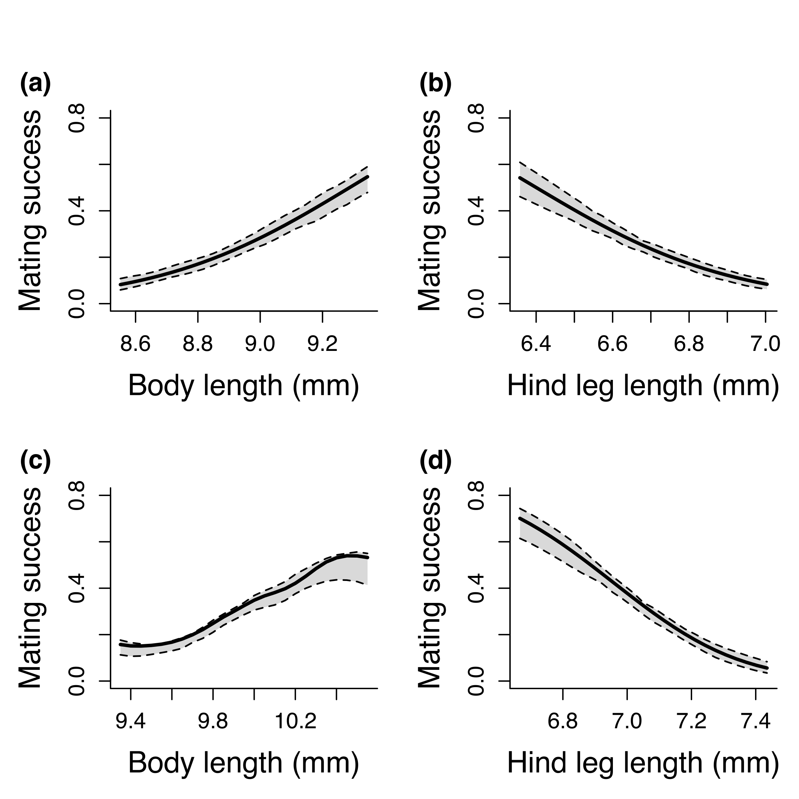
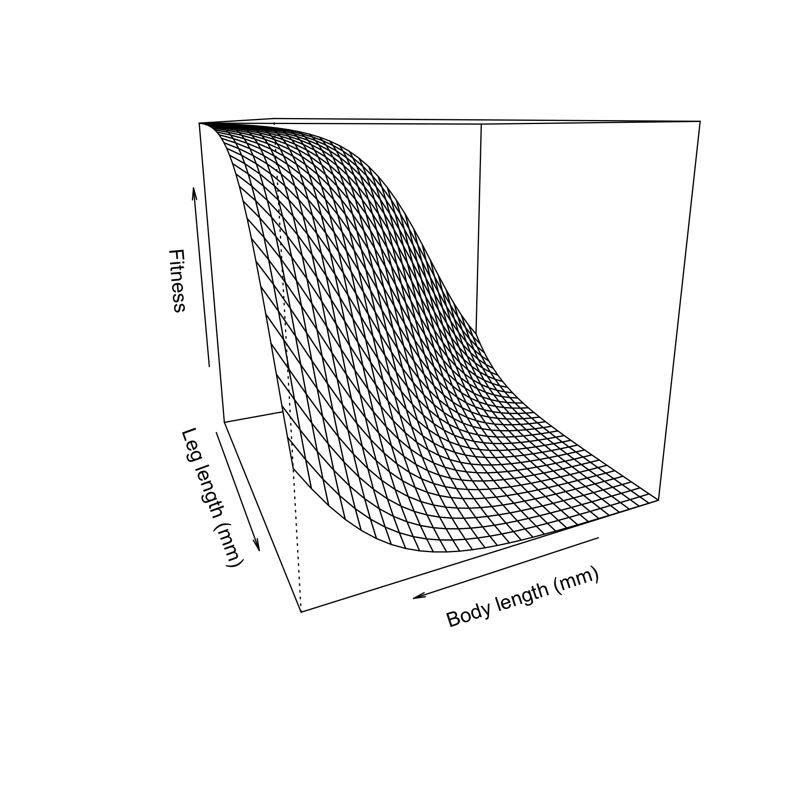

```{r echo=FALSE}
knitr::read_chunk('scripts/weevils.R')
```

```{r analysis, include=FALSE,echo=FALSE, warning=FALSE, results="hide"}
```

# Abstract

Sexual size dimorphism (SSD) arises from the interplay between fecundity selection and sexual selection, yet their relative contributions remain poorly understood, particularly in scramble-competitive systems.
I investigated the drivers of SSD in an undescribed flightless New Zealand weevil (*Lyperobates* sp. A) by quantifying fecundity selection on females and multivariate sexual selection on males using body length and hind leg length.
Female fecundity increased strongly with body size, indicating pronounced fecundity selection favouring larger females.
Contrary to expectations for scramble competition, sexual selection on males favoured larger body size, with larger males achieving higher mating success.
Selection was strongly multivariate: males with relatively shorter legs had higher mating success, and significant negative correlational selection indicated that fitness was maximized by specific trait combinations—large body size paired with short legs—producing a ridge-shaped fitness surface.
Females experienced directional selection on morphology but showed no evidence of nonlinear or correlational selection.
Despite strong selection on both sexes, there was no relationship between male and female body size within mating pairs, indicating an absence of assortative mating.
Females were significantly larger than males, confirming female-biased SSD.
These results demonstrate that SSD in this species is driven by fecundity selection on females and complex multivariate sexual selection on males, and that scramble competition can favour larger males.

# Introduction

Sexual size dimorphism (SSD)—systematic differences in body size between males and females—is a widespread and evolutionarily significant feature of animal morphology [@darwin871; @fairbairn2007].
The direction and magnitude of SSD vary widely across taxa, reflecting the balance of sex-specific selection pressures acting on body size [@fairbairnAllometrySexualSize1997; @blanckenhorn2000].
In many species, male-biased SSD arises through sexual selection driven by male–male competition or female choice [@andersson1994], whereas female-biased SSD is often attributed to fecundity selection, whereby larger females achieve higher reproductive output [@honek1993; @kingsolver2004; @pincheira-donoso2017; @blanckenhorn2005; @zhu2025].
However, fecundity selection alone cannot fully explain patterns of SSD, as the evolution of dimorphism also depends critically on the strength and direction of sexual selection acting on males [@fairbairn2007; @blanckenhorn2000].
Differences between males and females can therefore reflect sex-specific selection regimes acting on morphology, rather than a single uniform process [@judge2025].

When sexual selection favours increased male size—such as in systems involving male–male contest competition—male-biased SSD may evolve or female-biased SSD may be reduced [@andersson1994; @emlen1977].
Conversely, female-biased SSD is expected when sexual selection on males is weak, absent, or favours smaller, more mobile males [@ghiselin1974; @fairbairn2007].
Scramble-competitive mating systems are often invoked as a context in which smaller males are favoured because reproductive success depends on efficiently locating and securing mates rather than engaging in direct contests [@andersson1994; @moya-larano2002].
Empirical support for this “mobility hypothesis” comes from systems in which smaller males, or males possessing morphology that enhances locomotor performance, achieve higher mating success, including in Japanese beetles (*Popilla japonica*), where smaller males with relatively larger wings are more successful [@kelly2020] in the Cook Strait giant weta (*Deinacrida rugosa*) where males with smaller bodies and longer legs have greater mating success [@kelly2008a; @kelly2023c].
However, this expectation is not universal.
Comparative evidence shows that scramble competition encompasses diverse selective regimes, and that larger males frequently achieve greater mating success despite the presumed importance of mobility [@herberstein2017].
This suggests that traits such as endurance, mate detection, or persistence can outweigh any locomotor advantages of reduced body size.
Thus, predicting the direction of sexual selection on male size in scramble systems requires empirical evaluation rather than reliance on general assumptions.

Patterns of assortative mating can provide insight into how mating interactions are structured with respect to morphology, even in the absence of direct measures of reproductive success.
When mating is positively assortative, individuals with similar trait values pair more frequently than expected by chance, which may arise through size-based mate choice, spatial or temporal clustering of similar-sized individuals, or mechanical compatibility [@crespi1989; @jiang2013].
In contrast, negative assortative mating may occur when dissimilar trait combinations enhance mating success, for example if size differences facilitate mounting or reflect complementary functional roles during copulation.
In scramble-competitive systems, mating is typically driven by encounter rates rather than active mate choice, and therefore assortative mating is often expected to be weak or absent.
However, non-random pairing can still arise if body size influences encounter probabilities, mounting success, or the ability of males to maintain contact with females during prolonged copulation [@kelly2020].
Thus, examining assortative mating provides a means of assessing whether pair formation is structured by morphology or occurs largely at random.

Weevils (Curculionoidea) demonstrate significant ecological and mating system diversity among approximately 62,000 species [@haran2023], with around 1,500 species endemic to New Zealand [@may1993; see also @brown2017], making them valuable for investigating the role of sexual selection in the evolution of SSD.
Within this context, *Lyperobates* weevils, a genus of flightless, ground-dwelling beetles specific to New Zealand, are typically found in alpine and subalpine habitats (@fig-one).
These nocturnal insects occupy structurally complex environments where individuals emerge at night to forage and locate mates.
Notably, males do not appear to defend mating-related resources, indicating a scramble-competitive mating system [@andersson1994; @herberstein2017; @thornhillEvolutionInsectMating2013] in which mate encounter rates and search efficiency are crucial.
Once a male successfully locates and mounts a female, he may remain mounted for several hours, copulating intermittently throughout this duration.
Here, I investigate sexual size dimorphism in an undescribed species of *Lyperobates* (Coleoptera: Curculionidae: Entiminae; hereafter *Lyperobates* sp. A).

I test four predictions in this study.
First, I predict that fecundity selection favours larger females, resulting in a positive relationship between female body size and reproductive output.
Second, based on classic expectations for scramble competition, I predict that sexual selection on males will be weak or favour smaller body size, while acknowledging that alternative outcomes are possible [@herberstein2017].
Third, I predict that these forces will result in female-biased SSD.
Finally, I predict that mating will be random with respect to body size (i.e., no assortative mating), consistent with a scramble-competitive system in which pair formation is driven primarily by encounter processes rather than size-based compatibility or choice.

# Methods

### Study species

I studied a population of an undescribed species of *Lyperobates* weevil (hereafter *Lyperobates* sp. A) collected on Maud Island/Te Hoiere, New Zealand.
This taxon is currently under formal description, but can be reliably distinguished from described congeners based on consistent differences in body size, coloration, and elytral morphology (C.D. Kelly, personal observation.).
All individuals used in this study conformed to this diagnostic phenotype and are treated as a single, cohesive lineage.

Adult weevils were collected on 11 nights between 20 April and 5 May 2007 on Maud Island/Te Hoiere, New Zealand.
Individuals were located opportunistically at night by searching the ground and low vegetation (≤ 2 m height) along a 20 m section of track bordering forest habitat.Sampling commenced approximately 1 hour after sunset (\~18:30 h) and continued for two hours.
Weevils were found almost exclusively on the leaves of kawakawa (*Piper excelsum*).
Each observed male–female pair (N = 25), along with singleton males (N = 75) and females (N = 52), was collected and placed individually into 50 mL Falcon tubes, assigned a unique identification code, and transported to a field laboratory on Maud Island.
Specimens were subsequently euthanized by freezing.
All individuals were digitally photographed alongside a ruler for scale.
Females (N=69) were dissected to quantify fecundity by counting the number of eggs present in the reproductive tract.
Morphological measurements were obtained from digital images using Fiji [@schindelin2012], including body length (from the anterior edge of the thorax to the posterior edge of the abdomen) and hind leg length (third pair; from the proximal end of the femur to the distal end of the tibia), measured to the nearest 0.01 mm.

### Statistical analyses

All analyses were conducted in R [@rcoreteamLanguageEnvironmentStatistical2025].
Morphological traits were measured as total body length and total hind leg length.
Sex differences in these traits were first assessed using linear models with sex as a fixed effect.
Additionally, I performed a multivariate analysis of variance (MANOVA) to test for overall sexual dimorphism across traits.

To quantify the strength and form of selection on total body length and total hind leg length, I estimated standardized selection differentials and gradients following Lande and Arnold [-@lande1983] using the *gsg* R package [@morrissey2013].
Both traits were standardized to mean zero and unit variance prior to analysis.
Directional selection differentials (S) were calculated as the covariance between each trait and relative fitness [@lande1983].
Selection gradients were used to estimate direct selection on traits: linear gradients (β) describe directional selection, quadratic gradients (γ) describe nonlinear (stabilizing or disruptive) selection, and correlational gradients (γᵢⱼ) describe selection on trait combinations [@phillips1989; @brodie1995].
Fitness was modeled as a function of total body length and total hind leg length using spline-based generalized additive models [@wood2017], which allow flexible estimation of fitness surfaces without assuming a specific functional form and accommodate non-normal fitness distributions.
Male mating success was treated as a binomial response (mated = 1, unmated = 0).
Selection gradients (β, γ, γᵢⱼ) were estimated separately for each sex using standardized traits.
Statistical significance was assessed using permutation tests implemented in *gsg* [@morrissey2013], where trait–fitness associations were randomized to generate null distributions.

Female fecundity selection was analyzed using a negative binomial generalized linear model (GLM) to account for overdispersion in egg counts [@venables2002].
Egg number was modeled as a function of log-transformed body size.

Assessing assortative mating provides insight into whether mating pairs are structured by morphology or form independently of body size.
I evaluated assortative mating by testing for a relationship between male and female body size within mating pairs using linear regression on standardized traits [@crespi1989; @jiang2013].To determine whether the observed slope differed from random expectations, I performed a permutation test in which pairings were randomized and slopes recalculated across iterations.

# Results

#### Fecundity selection on females

In support of my first prediction, female fecundity increased significantly with body size (@fig-two), consistent with the widely reported positive relationship between body size and egg production in insects [@honek1993; @kingsolver2004].
Egg number was positively related to log-transformed body length ($\beta$ = `r myround(summary(female.fecundity)$coefficients[2,1],2)` ± `r myround(summary(female.fecundity)$coefficients[2,2],2)`, z = `r myround(summary(female.fecundity)$coefficients[2,3],2)`, `r pvalue(summary(female.fecundity)$coefficients[2,4],accuracy = 0.001, add_p=TRUE)`), indicating strong fecundity selection favouring larger females.

#### Sexual selection on males

Contrary to my second prediction, I found no evidence that sexual selection favours smaller males (@tbl-one).
Instead, male body length was under strong positive directional selection ($\beta$~i~ = `r myround(male.estimates[[1,1]],2)`  ± `r myround(male.estimates[[1,2]],2)`, `r pvalue(male.estimates[[1,3]],accuracy = 0.001, add_p=TRUE)`), indicating that larger males achieved higher mating success (@fig-three a).
This pattern is inconsistent with predictions of scramble-competition theory [@herberstein2017; @moya-larano2002; @kelly2008a].

Selection was multivariate in both sexes [@phillips1989], indicating that fitness depended on combinations of traits rather than traits in isolation.
In males, body length experienced positive directional selection, whereas hind leg length was under significant negative directional selection ($\beta$~j~ = `r myround(male.estimates[[2,1]],2)`  ± `r myround(male.estimates[[2,2]],2)`, `r pvalue(male.estimates[[2,3]],accuracy = 0.001, add_p=TRUE)`; @fig-three b), indicating that males with relatively shorter legs had higher mating success.

In addition to directional effects, both male traits exhibited significant nonlinear selection (@tbl-one).
Body length showed positive quadratic selection ($\gamma$~ii~ = `r myround(male.estimates[[3,1]],2)`  ± `r myround(male.estimates[[3,2]],2)`, `r pvalue(male.estimates[[3,3]],accuracy = 0.001, add_p=TRUE)`; @fig-three b), and leg length also experienced positive quadratic selection ($\gamma$~jj~ = `r myround(male.estimates[[4,1]],2)`  ± `r myround(male.estimates[[4,2]],2)`, `r pvalue(male.estimates[[4,3]],accuracy = 0.001, add_p=TRUE)`; @fig-three b), indicating curvature in the fitness surface.
Importantly, I also detected significant negative correlational selection between traits ($\beta$~i~ = `r myround(female.estimates[[1,1]],2)`  ± `r myround(female.estimates[[1,2]],2)`, `r pvalue(female.estimates[[1,3]],accuracy = 0.001, add_p=TRUE)`).
The fitness surface (@fig-four) reveals that this interaction strongly shapes the adaptive landscape, such that mating success is highest for males with large bodies and relatively short legs.
This produces a ridge-like fitness surface, rather than independent optima for each trait.

In females, directional selection was also evident: body length was under positive selection ($\beta$~i~ = `r myround(female.estimates[[1,1]],2)`  ± `r myround(female.estimates[[1,2]],2)`, `r pvalue(female.estimates[[1,3]],accuracy = 0.001, add_p=TRUE)`), while leg length was under strong negative selection ($\beta$~j~ = `r myround(female.estimates[[2,1]],2)`  ± `r myround(female.estimates[[2,2]],2)`, `r pvalue(female.estimates[[2,3]],accuracy = 0.001, add_p=TRUE)`; @fig-four).
However, I detected no evidence for nonlinear (@tbl-one) or correlational selection in females ($\gamma$~jj~ = `r myround(female.estimates[[4,1]],2)`  ± `r myround(female.estimates[[4,2]],2)`, `r pvalue(female.estimates[[4,3]],accuracy = 0.001, add_p=TRUE)`).

### Sexual size dimorphism

Consistent with my third prediction, females were significantly larger than males in both total body length and total hind leg length (@fig-five), demonstrating pronounced female-biased sexual size dimorphism (SSD), a pattern widely observed across insects [@fairbairn2007; @blanckenhorn2000].
Mean body length was `r summary_stats[[1,3]]` ± `r summary_stats[[1,4]]` mm (n = `r summary_stats[[1,2]]`) in females and `r summary_stats[[2,3]]` ± `r summary_stats[[2,4]]` mm (n = `r summary_stats[[2,2]]`) in males, indicating that females were approximately `r myround(((summary_stats[[1,3]]-summary_stats[[2,3]])/summary_stats[[2,3]])*100,1)`% larger than males (female:male ratio = `r myround((summary_stats[[1,3]]/summary_stats[[2,3]]),2)`).
Linear modelling confirmed that males were, on average, 1.00 mm shorter than females ($\beta$ = `r myround(summary(model_body)$coefficients[2,1],2)` ± `r myround(summary(model_body)$coefficients[2,2],2)`, t = `r myround(summary(model_body)$coefficients[2,3],2)`, `r pvalue(summary(model_body)$coefficients[2,4],accuracy = 0.001, add_p=TRUE)`; R^2 = `r myround(summary(model_body)$r.squared,2)`.

Hind leg length showed a similar pattern, with females exhibiting longer legs than males (`r summary_stats[[1,5]]` ± `r summary_stats[[1,6]]` mm vs. `r summary_stats[[2,5]]` ± `r summary_stats[[2,6]]` mm), corresponding to a `r myround(((summary_stats[[1,5]]-summary_stats[[2,5]])/summary_stats[[2,5]])*100,1)`% increase in females (ratio = `r myround((summary_stats[[1,5]]/summary_stats[[2,5]]),2)`).
This difference was also statistically significant ($\beta$ = `r myround(summary(model_leg)$coefficients[2,1],2)` ± `r myround(summary(model_leg)$coefficients[2,2],2)`, t = `r myround(summary(model_leg)$coefficients[2,3],2)`, `r pvalue(summary(model_leg)$coefficients[2,4],accuracy = 0.001, add_p=TRUE)`; R^2 = `r myround(summary(model_leg)$r.squared,2)`).
A multivariate analysis confirmed strong overall sexual dimorphism across traits (MANOVA: Pillai’s trace = `r myround(summary(manova_model)$stats[1, "Pillai"],2)`, F~`r summary(manova_model)$stats[1, "num Df"]`,`r summary(manova_model)$stats[1, "den Df"]`~ = `r myround(summary(manova_model)$stats[1, "approx F"],2)`, `r pvalue(summary(manova_model)$stats[1, "Pr(>F)"],accuracy = 0.001, add_p=TRUE)`).

#### Assortative mating

There was no evidence of assortative mating.
The relationship between male and female body size within mating pairs was weak and non-significant ($\beta$ = `r myround(summary(assort)$coefficients[2,1],2)` ± `r myround(summary(assort)$coefficients[2,2],2)`, t = `r myround(summary(assort)$coefficients[2,3],2)`, `r pvalue(summary(assort)$coefficients[2,4],accuracy = 0.001, add_p=TRUE)`), and did not differ from random expectations (P = `r p_val[1]`).
Thus, mating appeared random with respect to body size.

# Discussion

Although *Lyperobates* sp.
A remains formally undescribed, multiple lines of evidence indicate that it represents a distinct and cohesive taxonomic entity.
All individuals examined shared consistent morphological characteristics, and only a single morphotype was encountered at the study site.
It is therefore appropriate to treat this taxon as a single species for the purposes of analyzing patterns of selection and sexual size dimorphism.

Female *Lyperobates* sp.
A were significantly larger than males, confirming pronounced female-biased sexual size dimorphism (SSD).
This pattern is consistent with extensive evidence across insects showing that fecundity selection favours increased female size [@fairbairn2007; @honek1993; @blanckenhorn2005; @kingsolver2004; @pincheira-donoso2017].
Strong support for this mechanism was evident in this system, as larger females carried more eggs, demonstrating that increased body size directly enhances reproductive output.
These results indicate that fecundity selection is sufficiently strong to drive divergence in body size between the sexes.
More broadly, this pattern is consistent with models of sex-role evolution in which fe males are constrained by the costs of egg production, reducing selection for active mate searching and instead favouring greater investment in reproduction [@fromhage2016].

Contrary to classic expectations for scramble-competitive mating systems, sexual selection favoured larger males rather than smaller, more mobile individuals [@andersson1994; @moya-larano2002; @fairbairn2007].
Larger males achieved higher mating success, indicating strong positive directional selection on body length.
Although scramble competition is often assumed to favour reduced size due to advantages in mobility, empirical and comparative evidence suggests that this expectation is not universal [@herberstein2017].
For example, sexual selection favours smaller, more mobile males in some systems, such as Japanese beetles and giant weta [@kelly2020; @kelly2008a; @kelly2023c], whereas in others larger males achieve higher mating success despite the presumed importance of mobility.
These findings indicate that the direction of sexual selection on male size is highly context-dependent and cannot be predicted solely from mating system classification.
In this system, traits associated with encounter rate, persistence, or the ability to maintain contact with females may outweigh any locomotor advantages of smaller size.

Sexual selection on males was strongly multivariate [@phillips1989; @brodie1995].
In addition to positive directional selection on body length, males with relatively shorter hind legs achieved higher mating success, and I detected significant negative correlational selection between these traits.
This indicates that fitness is maximized by specific trait combinations rather than by independent trait values.
The resulting fitness surface is ridge-shaped, with highest mating success achieved by males combining large body size with relatively short legs.
This finding refines a simple “bigger is better” interpretation of sexual selection.
Although larger males generally have higher mating success, this advantage depends on their associated morphology.
Such correlational selection implies functional integration between traits, likely reflecting performance trade-offs that influence mate-search efficiency, stability during mating, or endurance.
More broadly, this result highlights that interpreting selection on individual traits in isolation can be misleading when fitness depends on trait combinations [@phillips1989].

In contrast to males, females experienced directional selection on morphology but showed no evidence of nonlinear or correlational selection.
Body length was under positive selection, whereas hind leg length was under negative selection, suggesting that similar trait axes influence fitness in both sexes but with simpler, largely additive effects in females.
The absence of multivariate selection in females may reflect differences in how morphology influences reproductive success, with fecundity primarily determined by body size rather than by complex trait interactions [@honek1993; @kingsolver2004].

I found no evidence of assortative mating with respect to body size, indicating that mating pairs form independently of size similarity or dissimilarity between males and females.
This result is consistent with expectations for scramble-competitive systems, in which pair formation is largely driven by encounter processes rather than active mate choice [@crespi1989; @jiang2013].
The absence of assortative mating suggests that, despite strong sexual selection on male morphology, body size does not structure which individuals mate with one another.
In particular, males with phenotypes favoured by selection—those with relatively large bodies and shorter legs—do not preferentially pair with females of any particular size.
This decoupling between selection on individual traits and the structure of mating pairs highlights that the processes determining mating success need not generate non-random pairing patterns [@mcdonald2016].

My results demonstrate that female-biased SSD in this *Lyperobates* weevil arises from the combined effects of strong fecundity selection on females and multivariate sexual selection on males.
While sexual selection favours increased male body size, this effect is contingent on trait combinations, emphasizing the importance of correlational selection in shaping male morphology.
This pattern is consistent with broader comparative work showing that SSD often reflects the combined effects of fecundity selection on females and sexual selection on males, with the balance between these forces varying across taxa [@stillwell2010].
At the same time, the absence of assortative mating indicates that mating structure does not reinforce or constrain these selective patterns, in contrast to systems where non-random mating can strengthen or weaken sexual selection [@kelly2023c; @mcdonald2016].
More broadly, these findings highlight that the evolution of SSD depends not only on the strength and direction of selection acting on individual traits, but also on how traits interact to influence performance and fitness.

Several limitations of my study should be noted.
Male mating success was measured as a binary outcome, which may obscure variation in reproductive success among mated individuals.
In addition, sampling was restricted to a limited temporal window, and behavioural observations were insufficient to directly link morphology to specific mating tactics.
Future work should integrate behavioural observations, experimental manipulations, and network-based analyses of mating interactions to better understand how trait combinations influence both mating success and fertilization outcomes.

In conclusion, this study shows that female-biased SSD in an undescribed *Lyperobates* weevil is driven by strong fecundity selection on females combined with complex, multivariate sexual selection on males.
The presence of strong correlational selection indicates that male fitness depends on integrated trait combinations rather than body size alone.
These results highlight the importance of adopting a multivariate perspective when studying sexual selection and the evolution of dimorphism, particularly in systems traditionally assumed to follow simple theoretical expectations.

\newpage

# Data availability

Data are available through the OSF repository at <https://doi.org/10.17605/OSF.IO/7FP9J.>

# Funding

This research was supported by a Natural Sciences and Engineering Research Council of Canada (NSERC) Discovery Grant.

# Conflict of Interest

I declare no conflict of interest.

# Acknowledgements

I thank Steve Ward of the New Zealand Department of Conservation for logistical support while this work was conducted on Maud Island.
I also thank Samuel Brown (The New Zealand Institute for Plant & Food Research Limited), Neil Birrell (University of Auckland), and Rich Leschen (New Zealand Arthropod Collection, Landcare Research Group) for help with taxonomic identification of my study species.

\newpage

# References {.unnumbered}

::: {#refs}
:::

\newpage

::: landscape
```{r}
#| echo: false
#| results: asis
#| warning: FALSE
#| label: tbl-one
#| tbl-cap: "Selection differentials (S, C) and standardized linear (β) and quadratic (γ) selection gradients for body length and leg length in female and male *Lyperobates* spp. weevils. Estimates are presented as mean ± SE. Differentials quantify total selection acting on traits, whereas gradients estimate direct selection after accounting for trait correlations. Linear gradients (β) describe directional selection, and quadratic gradients (γ) capture nonlinear selection (stabilizing or disruptive). P-values are shown for each estimate, and statistically significant effects (P < 0.05) are indicated in bold."

ft
```
:::

::: {#fig-one fig-cap="Mating pair of *Lyperobates* sp. A weevils. The male is mounted dorsally on the female in a typical copulatory position. (a) Lateral (side) view showing the male positioned atop the female’s abdomen, with legs grasping the female’s body. (b) Frontal view illustrating the alignment of the pair and relative positioning of the male on the female’s dorsum."}

:::

::: {#fig-two fig-cap="Relationship between female body size and fecundity. Points represent individual females, with fecundity measured as the total number of eggs produced. Body size is shown on a log scale (mm). The blue line indicates the fitted relationship from a generalized additive model, and the shaded region represents the 95% confidence interval. Fecundity increases nonlinearly with body size, with evidence for an accelerating (convex) relationship at larger sizes."}

:::

::: {#fig-three fig-cap="Fitness landscapes describing the relationship between morphology and mating success in males (a–b) and females (c–d). Panels show predicted mating success from generalized additive models as a function of body length (a, c) and hind leg length (b, d), with the alternate trait held constant. Solid lines represent model predictions and dashed lines indicate 95% confidence intervals estimated via parametric bootstrapping. Males exhibited positive directional selection on body length and negative directional selection on hind leg length, whereas females showed weaker positive selection on body length and negative selection on hind leg length. These patterns are consistent with estimates of linear selection gradients (β) reported in Table 1."}

:::

::: {#fig-four fig-cap="Fitness surface illustrating nonlinear and correlational selection on male morphology. Fitness is plotted as a function of body length and leg length (both in mm). The curved surface indicates strong nonlinear selection, with fitness highest for combinations of trait values along a ridge where relatively large body size is paired with shorter leg length. This pattern reflects negative correlational selection, indicating that the fitness consequences of one trait depend on the value of the other."}

:::

::: {#fig-five fig-cap="Sexual size dimorphism in body and leg morphology. Boxplots show total body length and total leg length (mm) for females (light grey) and males (dark grey), with points representing individual measurements. Horizontal lines indicate medians, boxes represent interquartile ranges, and whiskers extend to 1.5× the interquartile range. Females are larger than males for both traits, indicating female-biased sexual size dimorphism in overall body size and leg length."}

:::
