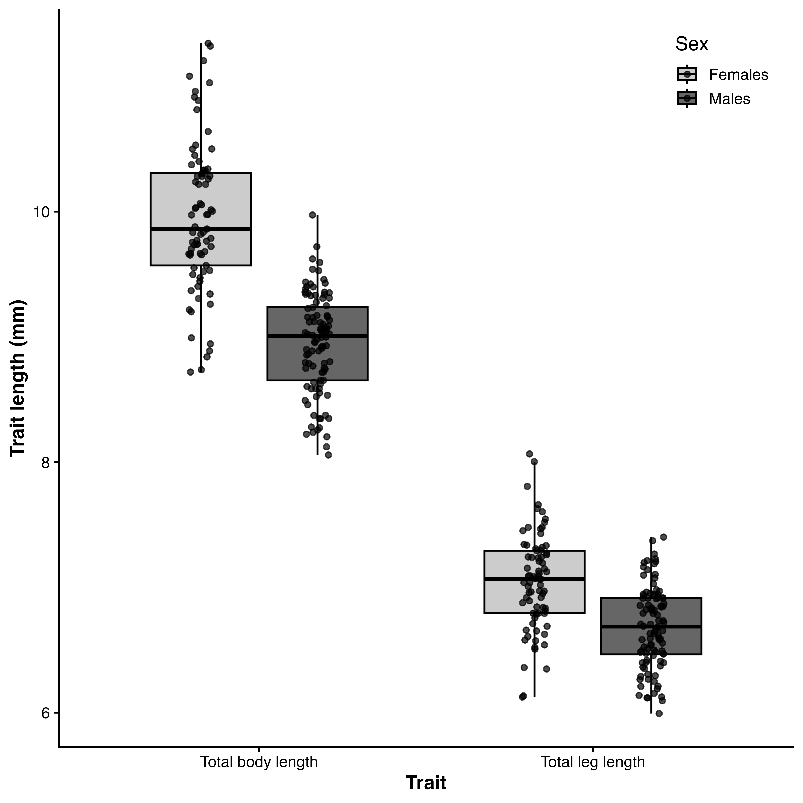

```{r echo=FALSE}
knitr::read_chunk('scripts/weevils.R')
```

```{r analysis, include=FALSE,echo=FALSE, warning=FALSE, results="hide"}
```


# Introduction
Sexual size dimorphism (SSD)—systematic differences in body size between males and females—is a widespread and evolutionarily significant feature of animal morphology (Darwin, 1871; Fairbairn, 1997). The direction and magnitude of SSD vary widely across taxa, reflecting the balance of sex-specific selection pressures acting on body size (Blanckenhorn, 2000; Fairbairn et al., 2007). In many species, male-biased SSD arises through sexual selection driven by male–male competition or female choice (Andersson, 1994), whereas female-biased SSD is often attributed to fecundity selection, whereby larger females achieve higher reproductive output (Honěk, 1993; Kingsolver & Pfennig, 2004; Blanckenhorn, 2005; Pincheira-Donoso & Hunt, 2017). However, fecundity selection alone cannot fully explain patterns of SSD, as the evolution of dimorphism also depends critically on the strength and direction of sexual selection acting on males (Fairbairn, 1997; Blanckenhorn, 2000).

When sexual selection favors increased male size—such as in systems involving male–male contest competition—male-biased SSD may evolve or female-biased SSD may be reduced (Andersson, 1994; Emlen & Oring, 1977). Conversely, female-biased SSD is expected when sexual selection on males is weak, absent, or favors smaller, more mobile males (Ghiselin, 1974; Blanckenhorn et al., 2007). Scramble-competitive mating systems are often invoked as a context in which smaller males are favored because reproductive success depends on efficiently locating and securing mates rather than engaging in direct contests (Andersson, 1994; Moya-Laraño et al., 2002). Empirical support for this “mobility hypothesis” comes from systems in which smaller males, or males possessing morphology that enhances locomotor performance, achieve higher mating success, including in Japanese beetles, where smaller males with relatively larger wings are more successful (kelly 2020) in the Cook Strait giant weta (Deinacrida rugosa) where males with smaller bodies and longer leggs have greater mating success (kelly et al. 2008; kelly and gwynne 2023). However, this expectation is not universal. Comparative evidence shows that scramble competition encompasses diverse selective regimes, and that larger males frequently achieve greater mating success despite the presumed importance of mobility (Herberstein et al., 2017). This suggests that traits such as endurance, mate detection, or persistence may outweigh any locomotor advantages of reduced body size. Thus, predicting the direction of sexual selection on male size in scramble systems requires empirical evaluation rather than reliance on general assumptions.

In addition to trait-based selection, patterns of mating interactions can strongly influence the strength of sexual selection. In polyandrous populations, where females mate with multiple males, reproductive success depends not only on mating success but also on the degree of sperm competition experienced by males. Crucially, this depends on how males share mating partners within a population. Sexual selection is therefore shaped by the relationship between a male’s mating success and the mating success of his partners, which determines the intensity of sperm competition he experiences (mcdonald and pizzarri 2016). When mating is positively assortative, males with high mating success tend to mate with highly polyandrous females, increasing sperm competition and reducing reproductive returns per mating (mcdonald and pizzarri 2016). Conversely, negative assortative mating can reduce sperm competition for successful males and strengthen sexual selection (e.g. kelly and gwynne 2023). These insights highlight that mating structure—not just mating success—plays a central role in determining the strength and direction of sexual selection.

Weevils (Curculionoidea) demonstrate significant ecological and mating system diversity among approximately 62,000 species [@haran2023], with around 1,500 species endemic to New Zealand [@may1993], making them valuable for investigating the role of sexual selection in the evolution of SSD. Within this context, *Lyperobates* weevils, a genus of flightless, ground-dwelling beetles specific to New Zealand, are typically found in alpine and subalpine habitats. These nocturnal insects occupy structurally complex environments where individuals emerge at night to forage and locate mates. Notably, males do not appear to defend mating-related resources, indicating a scramble-competitive mating system (Andersson, 1994; Blanckenhorn et al., 2007) in which mate encounter rates and search efficiency are crucial. Once a male successfully locates and mounts a female, he may remain mounted for several hours, copulating intermittently throughout this duration. Here, we investigate sexual size dimorphism in an undescribed species of *Lyperobates* (hereafter *Lyperobates* sp. A). We test four predictions. First, we predict that fecundity selection favors larger females, resulting in a positive relationship between female body size and reproductive output. Second, based on classic expectations for scramble competition, we predict that sexual selection on males will be weak or favor smaller body size, while acknowledging that alternative outcomes are possible (Herberstein et al., 2017). Third, we predict that these forces will result in female-biased SSD. Finally, we predict that patterns of assortative mating will reflect the direction of selection on male size.

#Methods
### Study species
I studied a population of an undescribed species of *Lyperobates* weevil (hereafter *Lyperobates* sp. A) collected on Maud Island/Te Hoiere, New Zealand. This taxon is currently under formal description, but can be reliably distinguished from described congeners based on consistent differences in body size, coloration, and elytral morphology (C.D. Kelly, personal observation.). All individuals used in this study conformed to this diagnostic phenotype and are treated as a single, cohesive lineage.

Adult weevils were collected on 11 nights between 20 April and 5 May 2007 on Maud Island/Te Hoiere, New Zealand. Individuals were located opportunistically at night by searching the ground and low vegetation (≤ 2 m height) along a 20 m section of track bordering forest habitat. Sampling commenced approximately 1 hour after sunset (~18:30 h) and continued for two hours. Weevils were found almost exclusively on the leaves of kawakawa (*Piper excelsum*). Each observed male–female pair (N = 25), along with singleton males (N = 77) and females (N = 52), was collected and placed individually into 50 mL Falcon tubes, assigned a unique identification code, and transported to a field laboratory on Maud Island. Specimens were subsequently euthanized by freezing. All individuals were digitally photographed alongside a ruler for scale. Females (N=69) were dissected to quantify fecundity by counting the number of eggs present in the reproductive tract. Morphological measurements were obtained from digital images using Fiji (Schindelin et al., 2012), including body length (from the anterior edge of the thorax to the posterior edge of the abdomen) and hind leg length (third pair; from the proximal end of the femur to the distal end of the tibia), measured to the nearest 0.01 mm.

### Statistical Analyses
All analyses were conducted in R (R Core Team, 2025). Morphological traits were measured as total body length and total leg length. Sex differences in these traits were first assessed using linear models with sex as a fixed effect. Additionally, we performed a multivariate analysis of variance (MANOVA) to test for overall sexual dimorphism across traits.

To quantify the strength and form of selection on total body length and total hind leg length, we estimated standardized selection differentials and gradients following Lande and Arnold (1983) using the *gsg* R package (Morrissey & Sakrejda, 2013). Both traits were standardized to mean zero and unit variance prior to analysis. Directional selection differentials (S) were calculated as the covariance between each trait and relative fitness (Lande & Arnold, 1983). Selection gradients were used to estimate direct selection on traits: linear gradients (β) describe directional selection, quadratic gradients (γ) describe nonlinear (stabilizing or disruptive) selection, and correlational gradients (γᵢⱼ) describe selection on trait combinations (Phillips & Arnold, 1989; Brodie et al. 1995). Fitness was modeled as a function of total body length and total hind leg length using spline-based generalized additive models (Wood, 2017), which allow flexible estimation of fitness surfaces without assuming a specific functional form and accommodate non-normal fitness distributions. Male mating success was treated as a binomial response (mated = 1, unmated = 0). Selection gradients (β, γ, γᵢⱼ) were estimated separately for each sex. Statistical significance was assessed using permutation tests implemented in gsg (Morrissey & Sakrejda, 2013), where trait–fitness associations were randomized to generate null distributions.

Female fecundity selection was analyzed using a negative binomial generalized linear model (GLM) to account for overdispersion in egg counts (Venables & Ripley, 2002). Egg number was modeled as a function of log-transformed body size.

Assessing assortative mating provides insight into how mating success translates into reproductive success, because it influences the distribution of sperm competition across males and thus the strength of sexual selection (macdonald and pizzarri 2016). We evaluated assortative mating by testing for a relationship between male and female body size within mating pairs using linear regression on standardized traits (Crespi, 1989; Jiang et al., 2013). To determine whether the observed slope differed from random expectations, we performed a permutation test in which pairings were randomized and slopes recalculated across iterations.

#Results

#### Fecundity Selection on Females (Prediction 1)
In support of our first prediction, female fecundity increased significantly with body size (Fig. 3), consistent with the widely reported positive relationship between body size and egg production in insects (Honěk, 1993; Kingsolver & Pfennig, 2004). Egg number was positively related to log-transformed body length (β = 4.50 ± 1.33, z = 3.39, P = 0.0007), indicating strong fecundity selection favoring larger females.

### Sexual Selection on Males (Prediction 2)
Contrary to our second prediction, we found no evidence that sexual selection favors smaller males. Instead, male body length was under significant positive directional selection (β = 1.000 ± 0.266, P = 0.002), indicating that larger males achieved higher mating success, which is a result inconsistent with predictions of scramble-competition theory (Blanckenhorn et al., 2007; Moya-Laraño et al., 2002).Selection was multivariate in both sexes (Phillips & Arnold, 1989). Body length experienced positive directional selection, while hind leg length was under negative selection. My selection analysis also suggests positive quadratic selection on male body length (Table 1); however, inspection of the fitness landscape (Figure 2a) does not suggest that this trait is under strong disruptive sexual selection. In males, we detected significant negative correlational selection between traits (γ = −0.565 ± 0.351, P = 0.004), indicating that males with larger bodies and relatively shorter legs had the highest fitness. No correlational selection was detected in females.

### Sexual Size Dimorphism (Prediction 3)
Consistent with our third prediction, females were significantly larger than males in both total body length and total hind leg length (Table 1; Fig. 1), demonstrating pronounced female-biased SSD, a pattern commonly observed across insect taxa (Fairbairn et al., 2007; Blanckenhorn, 2000). Mean body length was 9.95 ± 0.07 mm in females and 8.94 ± 0.04 mm in males (β = −1.02 ± 0.08 SE, t = −13.5, P < 2 × 10⁻¹⁶; R² = 0.51). Females also exhibited longer legs (7.05 ± 0.04 mm vs. 6.66 ± 0.03 mm; P = 2.9 × 10⁻¹¹). A MANOVA confirmed strong overall dimorphism.

#### Assortative Mating (Prediction 4)
There was no evidence of assortative mating. The relationship between male and female body size within mating pairs was weak and non-significant (β = −0.23 ± 0.20, P = 0.268), and did not differ from random expectations (P = 0.437; Crespi, 1989). Thus, mating appeared random with respect to body size.

# Discussion
Although *Lyperobates* sp. A remains formally undescribed, multiple lines of evidence indicate that it represents a distinct and cohesive taxonomic entity. All individuals examined shared consistent morphological characteristics, and only a single morphotype was encountered at the study site. We therefore consider it appropriate to treat this taxon as a single species for the purposes of analyzing patterns of selection and sexual size dimorphism. A formal description is currently in preparation.

Female-biased SSD and fecundity selection
Consistent with our predictions, females were significantly larger than males, demonstrating pronounced female-biased SSD. This pattern aligns with extensive evidence from insects showing that fecundity selection favors increased female size (Honěk, 1993; Shine, 1988; Fairbairn et al., 2007). We found strong support for this mechanism, with larger females carrying more eggs, indicating that increased body size directly enhances reproductive output. These results suggest that fecundity selection is sufficiently strong to drive divergence in body size between the sexes, even in the absence of strong opposing selection on males.

Sexual selection on males: context-dependent outcomes
Contrary to our initial prediction, we found that sexual selection favors larger males rather than smaller ones. While this result appears inconsistent with traditional expectations for scramble-competitive systems, it is broadly consistent with comparative evidence showing that larger males frequently achieve higher mating success even in the absence of direct contest competition (Herberstein et al., 2017). At the same time, other scramble systems conform to the classic mobility-based prediction. For example, in Japanese beetles, sexual selection favors smaller males and relatively larger wings, indicating that reduced body size and enhanced locomotor performance can improve mate-search efficiency (kelly 2020). The contrast between that system and our results highlights that the direction of selection on male size is highly context-dependent. Together, these findings indicate that scramble competition is not governed by a single selective mechanism. Instead, the direction of selection on male size likely reflects the relative importance of mobility, endurance, encounter rate, and post-encounter processes such as mate retention.

Mating structure and the strength of sexual selection
Recent work emphasizes that sexual selection depends not only on variance in mating success but also on how mating interactions are structured within populations. In polyandrous systems, males do not compete for exclusive access to females but instead share fertilization opportunities, such that reproductive success depends critically on the intensity of sperm competition they experience. This, in turn, is determined by the relationship between a male’s mating success and that of his partners (mcdonald and pizzarri 2016). When mating is positively assortative, successful males tend to mate with highly polyandrous females, resulting in diminishing reproductive returns per mating and weaker sexual selection. In contrast, negative assortative mating can reduce sperm competition for successful males and strengthen selection. In *Lyperobates* sp. A, we found no evidence of assortative mating, indicating that males do not systematically experience differences in sperm competition intensity based on their mating success. As a result, although larger males achieve higher mating success, the reproductive benefits of this success are unlikely to be strongly modified by mating structure. This suggests that sexual selection in this system is driven primarily by differences in mating success itself, rather than by structured variation in post-copulatory competition.

Multivariate selection and trait integration
Our results demonstrate that sexual selection acts on combinations of traits rather than on body size alone. In males, we detected correlational selection on body size and leg morphology, indicating that particular trait combinations (e.g. larger body size, shorter legs) maximize mating success. This finding is consistent with broader evidence that sexual selection often targets functionally integrated trait complexes rather than single traits in isolation (e.g., Kelly et al. 2008; kelly 2020). Such multivariate selection likely reflects performance trade-offs that influence mate-search efficiency, endurance, or mating persistence.For example, larger male *Lyperobates* sp. A may be more efficient at locating females, whereas shorter legs may enhance their ability to maintain purchase on the female during mating. These patterns emphasize that selection is inherently multivariate and that understanding sexual selection requires considering how traits interact to influence performance and fitness.

Synthesis and implications
Taken together, our results indicate that female-biased SSD in this *Lyperobates* weevil is primarily driven by strong fecundity selection on females, while sexual selection on males favors increased body size rather than reduced size. This pattern aligns with growing evidence that scramble competition does not impose a uniform selective regime and that larger males can be favored even in systems lacking direct contest competition (Herberstein et al., 2017). At the same time, the absence of assortative mating suggests that sexual selection is not strongly modulated by mating structure in this population, in contrast to systems where negative assortativity reinforces selection on successful males (macdonald and pizzarri 2016). More broadly, these findings highlight that the evolution of sexual size dimorphism depends on the interaction between fecundity selection, trait-specific sexual selection, and the structure of mating interactions. Variation across systems—from selection favoring smaller males to selection favoring larger males—underscores the importance of ecological and functional context in shaping evolutionary outcomes.

Limitations and future directions
Several limitations of my study should be noted. Male mating success was measured as a binary outcome, which may obscure variation in reproductive success. My sampling represents a limited temporal window, and behavioral observations were insufficient to directly link morphology to mating tactics. Future work should integrate behavioral observations, experimental manipulations, and network-based analyses of mating interactions to better understand how trait variation translates into reproductive success.

Conclusion
This study demonstrates that female-biased SSD in an undescribed *Lyperobates* weevil arises from strong fecundity selection on females combined with complex, multivariate sexual selection on males. The direction of sexual selection on male size, and its interaction with mating structure, highlights the need to move beyond simplified expectations of mating systems toward a more integrative understanding of sexual selection and dimorphism.


::: landscape
```{r}
#| echo: false
#| results: asis
#| warning: FALSE
#| label: tbl-one
#| tbl-cap: "Selection differentials (S, C) and standardized linear (β) and quadratic (γ) selection gradients for body length and leg length in female and male *Lyperobates* spp. weevils. Estimates are presented as mean ± SE. Differentials quantify total selection acting on traits, whereas gradients estimate direct selection after accounting for trait correlations. Linear gradients (β) describe directional selection, and quadratic gradients (γ) capture nonlinear selection (stabilizing or disruptive). P-values are shown for each estimate, and statistically significant effects (P < 0.05) are indicated in bold."

ft
```
:::

::: {#fig-one fig-cap="xxx"}


\newpage

::: {#fig-two fig-cap="Fitness landscapes describing the relationship between morphology and mating success in males (a–b) and females (c–d). Panels show predicted mating success from generalized additive models as a function of body length (a, c) and hind leg length (b, d), with the alternate trait held constant. Solid lines represent model predictions and dashed lines indicate 95% confidence intervals estimated via parametric bootstrapping. Males exhibited positive directional selection on body length and negative directional selection on hind leg length, whereas females showed weaker positive selection on body length and negative selection on hind leg length. These patterns are consistent with estimates of linear selection gradients (β) reported in Table X."}

:::
